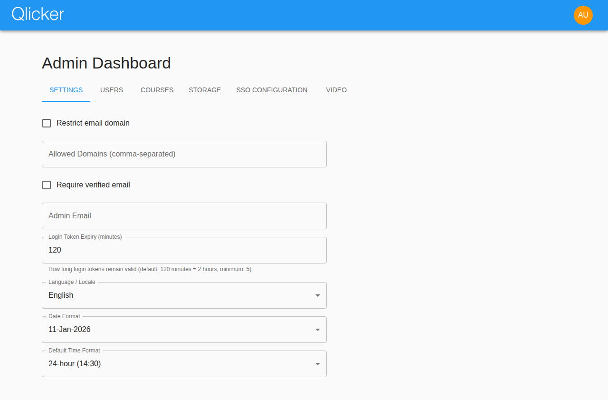
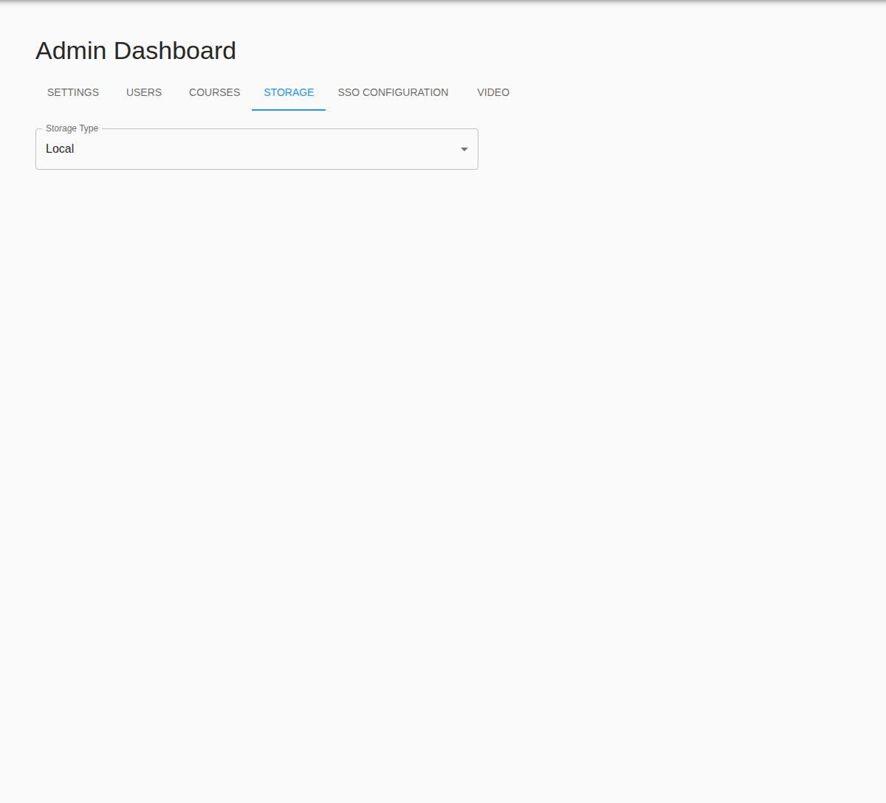

# Admin User Manual

Use this guide when configuring institution-wide settings, storage, SSO, user roles, and course-level support in the current Qlicker app.

## At a glance

- **Best starting page:** admin dashboard
- **Highest-risk workflows:** storage credentials, SSO certificates, and global login settings
- **Best support habit:** compare the problem against the professor or student manual before answering a user
- **Related guides:** [Professor manual](professor.md), [Student manual](student.md), [Production deployment guide](../../production_setup/README.md)

## Table of contents

1. [Admin dashboard](#admin-dashboard)
2. [General settings](#general-settings)
3. [Backup and recovery](#backup-and-recovery)
4. [User and course support](#user-and-course-support)
5. [Storage configuration](#storage-configuration)
6. [SSO configuration](#sso-configuration)
7. [Video configuration](#video-configuration)
8. [Troubleshooting checklist](#troubleshooting-checklist)

## Quick start checklist

1. Confirm the deployment environment and public URLs before changing app settings.
2. Review general settings, storage, SSO, and video before large onboarding periods.
3. Use the Users and Courses tabs for day-to-day support and verification.
4. Retest any global auth or storage change before announcing it to users.

## Admin dashboard

The admin dashboard centralizes institution-wide configuration.

The current app exposes these major tabs:

- **Settings** for general platform defaults
- **Users** for role and account management
- **Courses** for broad course lookup and support
- **Backup** for scheduled database backup policy and recovery status
- **Storage** for image backends
- **SSO Configuration** for SAML settings
- **Video** for Jitsi configuration and availability

Because the dashboard autosaves after short pauses, review each field carefully before leaving a tab.

## General settings

Use the Settings tab to control defaults that affect every user.

Common settings include:

- allowed email domains
- whether verified email is required
- the administrative support email
- login/session lifetime
- default locale
- default date format
- default time format

### Best practices

| Setting | Recommendation |
| --- | --- |
| Allowed domains | Keep the list explicit and comma-separated |
| Verified email | Decide this before onboarding large numbers of users |
| Support/admin email | Use a monitored mailbox so error messages reach a real team |
| Login/session lifetime | Default is 120 minutes (2 hours); this now controls both access tokens and the refresh-session hard expiry for newly issued sessions |
| Locale/date/time defaults | Pick institution-wide defaults, then let users override them when appropriate |

## Backup and recovery

Use the Backup tab to manage scheduled MongoDB backups without taking the app offline.

By default, Qlicker keeps:

- one backup for each of the last 7 days
- one backup for each of the last 4 weeks
- one backup for each of the last 12 months

Key facts for admins:

- backups are written locally to `production_setup/backups/` on the host
- the backup manager runs `mongodump` against the live database while the app is still running
- archive names include the timestamp and tier, for example `qlicker_backup_20260321_020000_daily.tar.gz`
- the Backup tab shows the configured schedule, retention counts, and the last run's status, message, and filename

For full disaster recovery, follow the restore workflow in [production_setup/README.md](../../production_setup/README.md), then verify the recovered system by signing in and checking the Backup tab plus a few representative courses and users.

## User and course support

### Users tab

The Users tab is your main support surface for accounts.

From there you can:

- search users by name or email
- create accounts directly
- change roles
- verify email status
- inspect or update per-user properties
- disable an account temporarily and restore it later without losing its history
- confirm whether a user is currently logged in and see the IP address for each active session
- inspect the last recorded login time and IP address when the user is not currently signed in
- reset a user's local password
- control whether local email login is allowed for a specific account when institution-wide SSO is enabled
- inspect which courses a user belongs to as a student, TA, or instructor directly in the user modal

Use extra care when changing roles because the effect is immediate.

If a student-only account is listed in a course's instructor roster, the UI labels that membership as **TA**. That wording is only a presentation hint. It does not create a new stored role.

Prefer disabling over deleting when support staff may need to restore the account later. A disabled user cannot log in, refresh tokens, or continue using an existing authenticated session, but the underlying records stay available for future restoration.

The Last Login column now shows date and time, not just the day, so support staff can compare account activity against reports from a user more accurately.
When you reset a user's local password from the user modal, Qlicker now saves a current Argon2 local password immediately and clears any pending reset token for that account.

### Courses tab

The Courses tab helps admins support instructors without signing in as them.

Use it to:

- locate courses by code, title, or term
- verify who owns or teaches a course
- confirm whether a course appears active and ready for students
- reproduce support questions against the current course configuration

## Storage configuration

Qlicker supports multiple image-storage backends, managed from the Storage tab.

Supported modes include:

- local storage
- Amazon S3 or S3-compatible storage
- Azure Blob storage

The storage choice is saved in the database. New deployments start on local storage, and runtime `.env` values are not used for storage selection.
Regardless of backend, Fastify serves stored images through its `/uploads/<key>` path. When cutting over legacy public S3 data, run the sanitize workflow from [production_setup/README.md](../../production_setup/README.md) after saving the S3 settings here.

### Storage workflow

1. Choose the provider.
2. Fill only the fields required by that provider.
3. Set the maximum upload width (default `1920px`) so profile photos and rich-text-editor images are resized before upload.
4. Set the avatar thumbnail size (default `512px`) to control cropped profile-photo sharpness.
5. Save the settings.
6. Upload a test image from the app to confirm read and write behavior.

### Provider-specific notes

| Provider | Required fields to verify |
| --- | --- |
| Local | uploaded files survive restarts and deployments |
| Amazon S3 / compatible | bucket, region, access key, secret key, optional endpoint/path-style support |
| Azure Blob | storage account, access key, container name |

Treat access keys, secret keys, and similar credentials as secrets.

Profile pictures now open a crop/rotate dialog and store a separate square avatar thumbnail. Dragging the crop can produce sub-pixel coordinates, and Qlicker rounds those safely on save. After storage changes, test both a profile photo upload and a question-editor image upload.

## SSO configuration

The SSO Configuration tab manages SAML settings for institutional login.

Prepare the following before enabling SSO:

- IdP entry point URL
- logout URL
- entity ID / issuer values
- email, first-name, last-name, role, and student-number attribute mappings
- the IdP certificate
- the SP certificate and private key if your deployment requires them

The advanced SAML options are hidden behind an **Advanced (dangerous) settings** control. Leave them at their defaults unless your IdP requires different `node-saml` behavior. The defaults match the current production Microsoft Entra configuration:

- `wantAssertionsSigned = false`
- `wantAuthnResponseSigned = false`
- `acceptedClockSkewMs = 60000`
- `disableRequestedAuthnContext = true`
- route mode = legacy `/SSO/SAML2`

If your IdP expects the newer callback/logout surface, switch the presented route set to `/api/v1/auth/sso/*`. Change that only after confirming the IdP metadata and callback URLs.

### After any SSO change, always retest

- sign-in
- callback handling
- logout
- professor and student role mapping

If SSO is wrong, it can prevent access for many users at once, so make changes during a maintenance window when possible.

## Video configuration

Qlicker can integrate Jitsi-based video workflows.

The Video tab is where you:

- enable or disable video globally
- define the Jitsi domain
- configure related Etherpad settings if used
- verify which courses should expose video options

After configuration, test with a real course before announcing the feature.

## Troubleshooting checklist

### Users cannot sign in

Check:

- whether SSO is enabled unexpectedly
- whether SSO metadata and certificates are current
- whether local email login has been explicitly allowed for the affected account
- whether the configured login/session lifetime for newly issued sessions is shorter than the user's expectation
- whether the public deployment URLs match the running environment

### Backups or recovery look wrong

Check:

- whether the Backup tab is enabled and the schedule matches the server's local timezone
- whether the `production_setup/backups/` directory is writable and has free space
- whether the last-run status in the Backup tab shows a recent error message
- whether the archive name you are restoring matches the expected tier and timestamp

### Uploaded images fail

Check:

- the selected storage provider
- the provider credentials
- bucket or container existence and permissions
- whether a recent configuration change was saved incompletely
- whether a fresh test upload reproduces the problem

### Professors cannot access expected course features

Check:

- their role
- course instructor membership
- course settings such as video availability or student-submission permissions
- whether the feature depends on a global admin setting

## Related manuals

- [Professor user manual](professor.md)
- [Student user manual](student.md)
- [Production deployment guide](../../production_setup/README.md)
