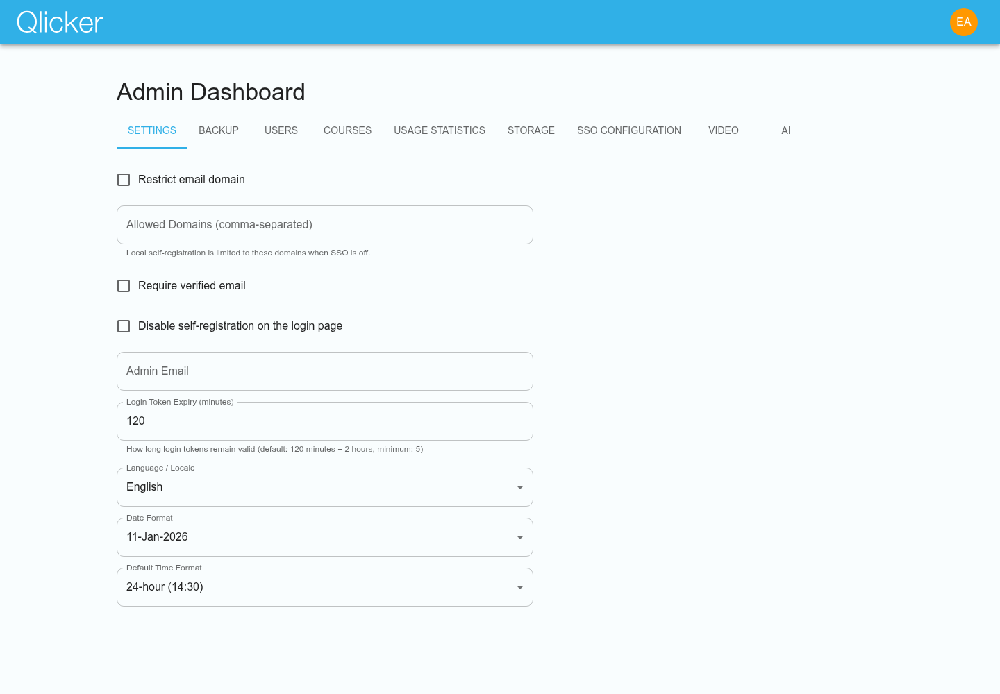
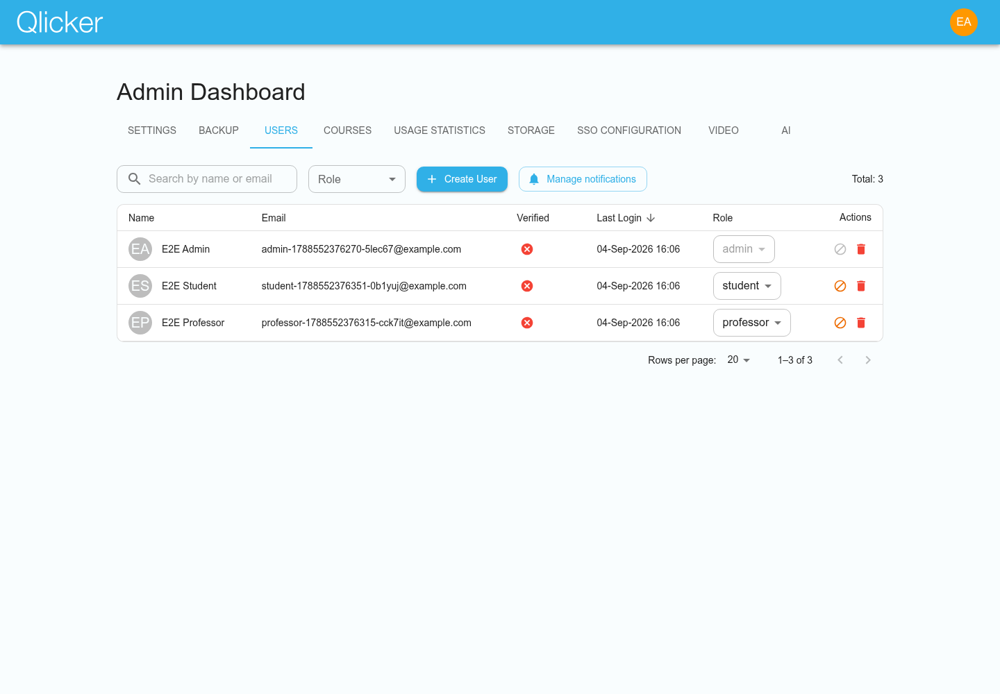
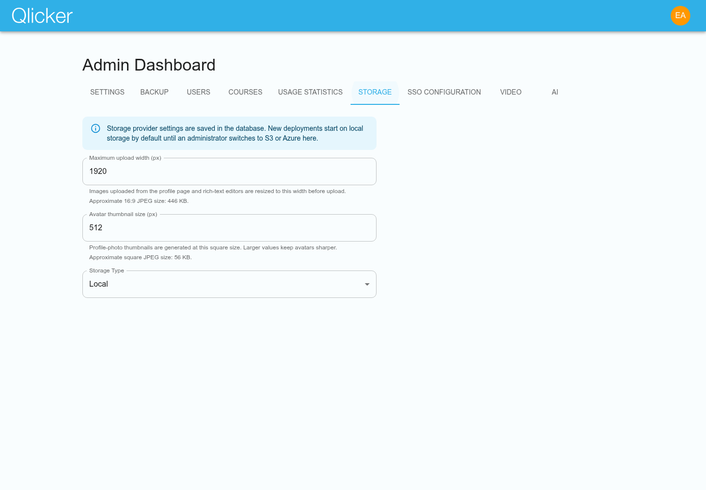
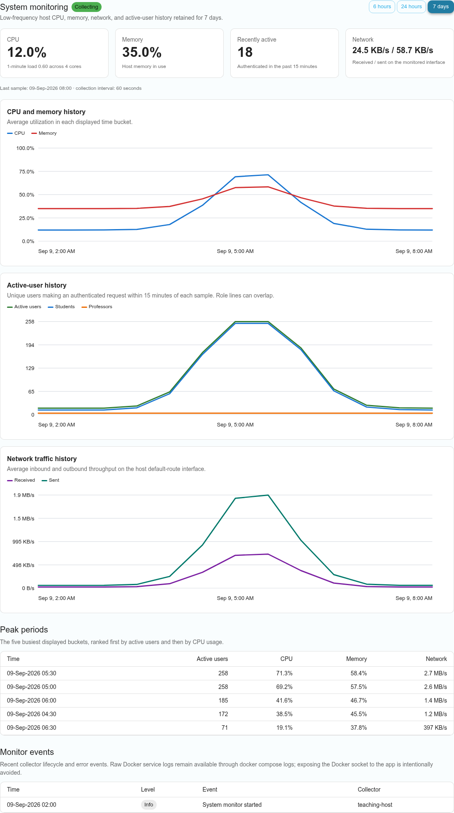

# Admin User Manual

Use this guide to configure institution-wide settings and integrations, support accounts/courses, monitor use, and protect recoverability. Read [Getting started](getting-started.md) before changing a production system.

## At a glance

- **Best starting page:** admin dashboard
- **Highest-risk workflows:** storage credentials, SSO certificates, and global login settings
- **Best support habit:** compare the problem against the professor or student manual before answering a user
- **Related guides:** [Professor manual](professor.md), [Student manual](student.md), [Production deployment guide](../../production_setup/README.md)

## Table of contents

1. [Admin dashboard](#admin-dashboard)
2. [General settings](#general-settings)
3. [Backup and recovery](#backup-and-recovery)
4. [User and course support](#user-and-course-support)
5. [Storage configuration](#storage-configuration)
6. [SSO configuration](#sso-configuration)
7. [Usage statistics](#usage-statistics)
8. [Video configuration](#video-configuration)
9. [AI helper configuration](#ai-helper-configuration)
10. [Operational safety and troubleshooting](#operational-safety-and-troubleshooting)

## Quick start checklist

1. Confirm the deployment environment and public URLs before changing app settings.
2. Review general settings, backup, storage, SSO, video, and AI policy before large onboarding periods.
3. Use the Users and Courses tabs for day-to-day support and verification.
4. Retest any global auth or storage change before announcing it to users.

## Admin dashboard

The admin dashboard centralizes institution-wide configuration.

The current app exposes these major tabs:

- **Settings** for general platform defaults
- **Backup** for scheduled database backup policy and recovery status
- **Users** for role and account management
- **Courses** for broad course lookup and support
- **Usage Statistics** for active-use trends and the most active courses
- **Storage** for image backends
- **SSO Configuration** for SAML settings
- **Video** for Jitsi configuration and availability
- **AI** for permitted backends, models, private-network policy, and course availability

Because the dashboard autosaves after short pauses, review each field carefully before leaving a tab.

## General settings

Use the Settings tab to control defaults that affect every user.

Common settings include:

- allowed email domains
- whether verified email is required
- the administrative support email
- login/session lifetime
- default locale
- default date format
- default time format

### Best practices

| Setting | Recommendation |
| --- | --- |
| Allowed domains | Keep the list explicit and comma-separated |
| Verified email | Decide this before onboarding large numbers of users |
| Support/admin email | Use a monitored mailbox so error messages reach a real team |
| Login/session lifetime | Default is 120 minutes (2 hours); this now controls both access tokens and the refresh-session hard expiry for newly issued sessions |
| Locale/date/time defaults | Pick institution-wide defaults, then let users override them when appropriate |

## Backup and recovery

Use the Backup tab to manage scheduled MongoDB backups without taking the app offline.

By default, Qlicker keeps:

- one backup for each of the last 7 days
- one backup for each of the last 4 weeks
- one backup for each of the last 12 months

Key facts for admins:

- backups are written locally to `production_setup/backups/` on the host
- the backup manager runs `mongodump` against the live database while the app is still running
- archive names include the timestamp and tier, for example `qlicker_backup_20260321_020000_daily.tar.gz`
- the Backup tab shows the configured schedule, retention counts, and the last run's status, message, and filename

For full disaster recovery, follow the restore workflow in [production_setup/README.md](../../production_setup/README.md), then verify the recovered system by signing in and checking the Backup tab plus a few representative courses and users.

## User and course support

### Users tab

The Users tab is your main support surface for accounts.

From there you can:

- search users by name or email
- create accounts directly
- change roles
- verify email status
- inspect or update per-user properties
- disable an account temporarily and restore it later without losing its history
- confirm whether a user is currently logged in and see the IP address for each active session
- inspect the last recorded login time and IP address when the user is not currently signed in
- reset a user's local password
- control whether local email login is allowed for a specific account when institution-wide SSO is enabled
- inspect which courses a user belongs to as a student, TA, or instructor directly in the user modal

Use extra care when changing roles because the effect is immediate.

If a student-only account is listed in a course's instructor roster, the UI labels that membership as **TA**. That wording is only a presentation hint. It does not create a new stored role.

Prefer disabling over deleting when support staff may need to restore the account later. A disabled user cannot log in, refresh tokens, or continue using an existing authenticated session, but the underlying records stay available for future restoration.

The Last Login column now shows date and time, not just the day, so support staff can compare account activity against reports from a user more accurately.
When you reset a user's local password from the user modal, Qlicker now saves a current Argon2 local password immediately and clears any pending reset token for that account.

### Courses tab

The Courses tab helps admins support instructors without signing in as them.

Use it to:

- locate courses by code, title, or term
- verify who owns or teaches a course
- confirm whether a course appears active and ready for students
- reproduce support questions against the current course configuration

## Storage configuration

Qlicker supports multiple image-storage backends, managed from the Storage tab.

Supported modes include:

- local storage
- Amazon S3 or S3-compatible storage
- Azure Blob storage

The storage choice is saved in the database. New deployments start on local storage, and runtime `.env` values are not used for storage selection.
Regardless of backend, Fastify serves stored images through its `/uploads/<key>` path. When cutting over legacy public S3 data, run the sanitize workflow from [production_setup/README.md](../../production_setup/README.md) after saving the S3 settings here.

### Storage workflow

1. Choose the provider.
2. Fill only the fields required by that provider.
3. Set the maximum upload width (default `1920px`) so profile photos and rich-text-editor images are resized before upload.
4. Set the avatar thumbnail size (default `512px`) to control cropped profile-photo sharpness.
5. Save the settings.
6. Upload a test image from the app to confirm read and write behavior.

### Provider-specific notes

| Provider | Required fields to verify |
| --- | --- |
| Local | uploaded files survive restarts and deployments |
| Amazon S3 / compatible | bucket, region, access key, secret key, optional endpoint/path-style support |
| Azure Blob | storage account, access key, container name |

Treat access keys, secret keys, and similar credentials as secrets.

Profile pictures now open a crop/rotate dialog and store a separate square avatar thumbnail. Dragging the crop can produce sub-pixel coordinates, and Qlicker rounds those safely on save. After storage changes, test both a profile photo upload and a question-editor image upload.

## SSO configuration

The SSO Configuration tab manages SAML settings for institutional login.

Prepare the following before enabling SSO:

- IdP entry point URL
- logout URL
- entity ID / issuer values
- email, first-name, last-name, role, and student-number attribute mappings
- the IdP certificate
- the SP certificate and private key if your deployment requires them

The advanced SAML options are hidden behind an **Advanced (dangerous) settings** control. Leave them at their defaults unless your IdP requires different `node-saml` behavior. The defaults match the current production Microsoft Entra configuration:

- `wantAssertionsSigned = false`
- `wantAuthnResponseSigned = false`
- `acceptedClockSkewMs = 60000`
- `disableRequestedAuthnContext = true`
- route mode = legacy `/SSO/SAML2`

If your IdP expects the newer callback/logout surface, switch the presented route set to `/api/v1/auth/sso/*`. Change that only after confirming the IdP metadata and callback URLs.

### After any SSO change, always retest

- sign-in
- callback handling
- logout
- professor and student role mapping

If SSO is wrong, it can prevent access for many users at once, so make changes during a maintenance window when possible.

## Usage statistics

Open **Admin → Usage Statistics**. The first cards count unique accounts by their recorded last login over the past hour, 24 hours, and 7 days; the course table ranks enrolled members with recent logins. These are login summaries, not a count of currently connected browsers.

### Investigate busy teaching periods

1. Scroll to **System monitoring** and select **6 hours**, **24 hours**, or **7 days**.
2. Compare **CPU and memory history** with **Active-user history** at the same time. The **Peak periods** table lists the five busiest displayed periods, ranked by active users and then CPU.
3. Compare inbound and outbound **Network traffic history** with those peaks. A busy classroom may have high user activity without high host utilization; sustained high resource use at quiet times warrants an operational investigation.

   Hover over a chart to see the nearest time bucket's timestamp and each curve's value, including units. A dashed vertical guide and dots identify the selected coordinates. These are recorded bucket values, not interpolated measurements; **No reading** means data is missing. You can also tap the chart, or focus it with Tab and use Left/Right to move between buckets and Home/End for the first/last bucket. Escape dismisses the readout.

4. Check the last sample timestamp. Use **Refresh** for current data; the page does not continuously poll. Results can be cached for 30 seconds.
5. If samples are **Stale**, review **Monitor events** for collection failures, recovery, and Redis availability. A missing history means the collector has not supplied data for that range. Ask the operator to check the service if no event explains the gap.

*The illustration is a Chromium capture using example monitoring data; it does not describe the load on your installation.*

### Understand the measurements

| Measurement | Interpretation |
| --- | --- |
| CPU | Percentage busy across all host CPU cores, averaged between samples. The load value is Linux's one-minute load average, not a percentage. |
| Memory | `(MemTotal − MemAvailable) / MemTotal × 100`, for the whole host. The card also shows used, total, and available RAM. Linux estimates available RAM allowing for reclaimable cache; this is not simply total minus free RAM or Qlicker's process memory. |
| Network | Average received/sent bytes per second on the displayed interfaces, including other applications' traffic. Automatic selection prefers non-tunnel default-route interfaces, avoiding VPN/uplink double counting. KiB/s means 1,024 bytes per second; MiB/s means 1,048,576 bytes per second. The chart scales to observed traffic, not link capacity. |
| Recently active | Unique authenticated users making an API request during the preceding 15 minutes by default. Multiple tabs/replicas deduplicate by user. Idle signed-in users and browsers only receiving WebSocket updates can age out; logout does not immediately remove recent activity. |
| Role lines | Students and professors with recent requests. Users with multiple roles can appear in multiple lines; total users remain deduplicated. |
| History | Seven days, starting when the collector is installed. Default sampling is once per minute. Display buckets are 1 minute, 5 minutes, or 30 minutes for the three ranges. Resource values are averages; active-user values are the maximum sample count in each bucket. Very brief spikes can be missed. |

Host metrics cover the native Linux machine or the machine running Docker, including MongoDB, Redis, Qlicker, and other workloads. On Docker Desktop this is the Linux VM. They are not per-process or per-container measurements. A desktop using 40 GiB out of 64 GiB can legitimately show 62.5% even when Qlicker is quiet. CPU is normalized over all cores: one fully busy core on a 16-core machine contributes about 6.25%. See the [Linux counter definitions](https://docs.kernel.org/filesystems/proc.html) for the underlying measurements.

To investigate a high reading, compare the sample timestamp with host tools such as `free`, `top`, and your network monitor. Compare **available** RAM, not just the `used` column of `free`, whose definition varies by version. CPU/network cards average the sampling interval (normally 60 seconds), so a one-second desktop monitor can show different values. Check the displayed network interfaces: selecting both a VPN and its underlying Wi-Fi/Ethernet interface explicitly can still count the same packets twice. Ask the operator to select only the intended interface if automatic selection does not match the host's routing.

Missing measurements are shown as gaps or dashes; unavailable Redis activity is not reported as zero users. After a collector fix or interface change, older history is not rewritten and expires after seven days; use the latest sample to check the change.

**Monitor events** provides the latest 50 collector events from the past seven days, with collection error details. Full API, database, proxy, and operating-system logs are not imported into this page; operators can use the [deployment log commands](../../production_setup/README.md#monitoring--logs). The collector has no Docker-control access.

- Use trends to decide whether a reported incident is isolated or site-wide.
- Expect values to depend on the app's recorded activity windows; do not interpret them as attendance or grades.
- Avoid sharing screenshots that expose course names or usage patterns beyond the support team.
- Correlate unexpected changes with server/Redis/MongoDB health and deployment logs.

## Video configuration

Qlicker can integrate Jitsi-based video workflows.

The Video tab is where you:

- enable or disable video globally
- define the Jitsi domain
- configure related Etherpad settings if used
- verify which courses should expose video options

After configuration, test with a real course before announcing the feature.

## AI helper configuration

The **AI** tab controls whether instructors can configure course AI, which backends/models are available, and whether a model may be offered to students. Backends can use supported Ollama- or OpenAI-compatible APIs.

Before enabling a backend:

1. Confirm institutional privacy, retention, and academic-integrity policy.
2. Enter the exact HTTPS or approved internal endpoint and API token.
3. For private-network hosts, allow only the exact trusted hostname in the production environment; do not allow an entire private subnet.
4. Add models with clear display names and mark only tested models available.
5. Decide which models students may use; instructor availability does not imply student availability.
6. Test a low-risk course, including errors/timeouts, before broad access.

Course instructors can then opt in per course, choose defaults, set student guidance and tool-round limits, and maintain reusable grading/feedback/summary rubrics. AI can produce inaccurate content or grading, so human review remains required.

Instructor AI features are deliberately separate: course-aware AI Chat, draft-and-approval course edits/chat posts, per-question response summaries, AI-assisted grading, and optional student AI Chat. When supporting a course, verify the specific workflow and model policy involved rather than treating the course-level AI switch as proof that every AI feature is ready. See the professor manual's [AI workflow](professor.md#10-use-ai-for-teaching-and-course-management).

Treat AI API tokens as secrets. Never put credentials into course guidance or model display names.

## Operational safety and troubleshooting

### Change-management checklist

For SSO, storage, backup, or AI changes:

1. Record the current setting without copying secret values into tickets or chat.
2. Confirm a recent restorable backup for changes that can affect data access.
3. Make the change during an appropriate support window.
4. Wait for the autosave confirmation.
5. Test with non-production/sample accounts and content.
6. Check health/logs, then communicate the outcome and rollback plan.

The UI configures application policy. Host files, TLS certificates, Docker services, off-host backup copies, and restore drills remain operator responsibilities documented in the [production guide](../../production_setup/README.md).

### Users cannot sign in

Check:

- whether SSO is enabled unexpectedly
- whether SSO metadata and certificates are current
- whether local email login has been explicitly allowed for the affected account
- whether the configured login/session lifetime for newly issued sessions is shorter than the user's expectation
- whether the public deployment URLs match the running environment

### Backups or recovery look wrong

Check:

- whether the Backup tab is enabled and the schedule matches the server's local timezone
- whether the `production_setup/backups/` directory is writable and has free space
- whether the last-run status in the Backup tab shows a recent error message
- whether the archive name you are restoring matches the expected tier and timestamp

### Uploaded images fail

Check:

- the selected storage provider
- the provider credentials
- bucket or container existence and permissions
- whether a recent configuration change was saved incompletely
- whether a fresh test upload reproduces the problem

### Professors cannot access expected course features

Check:

- their role
- course instructor membership
- course settings such as video availability or student-submission permissions
- whether the feature depends on a global admin setting

### AI is missing or requests fail

Check:

- whether global AI and course-backend access are enabled
- the exact backend URL, token, and configured model ID
- whether the model is marked available and, for students, student-available
- private-host allowlist policy and TLS/network reachability from the server container
- the configured request timeout and backend logs

## Related manuals

- [Professor user manual](professor.md)
- [Student user manual](student.md)
- [Grading guide](grading.md)
- [Production deployment guide](../../production_setup/README.md)
