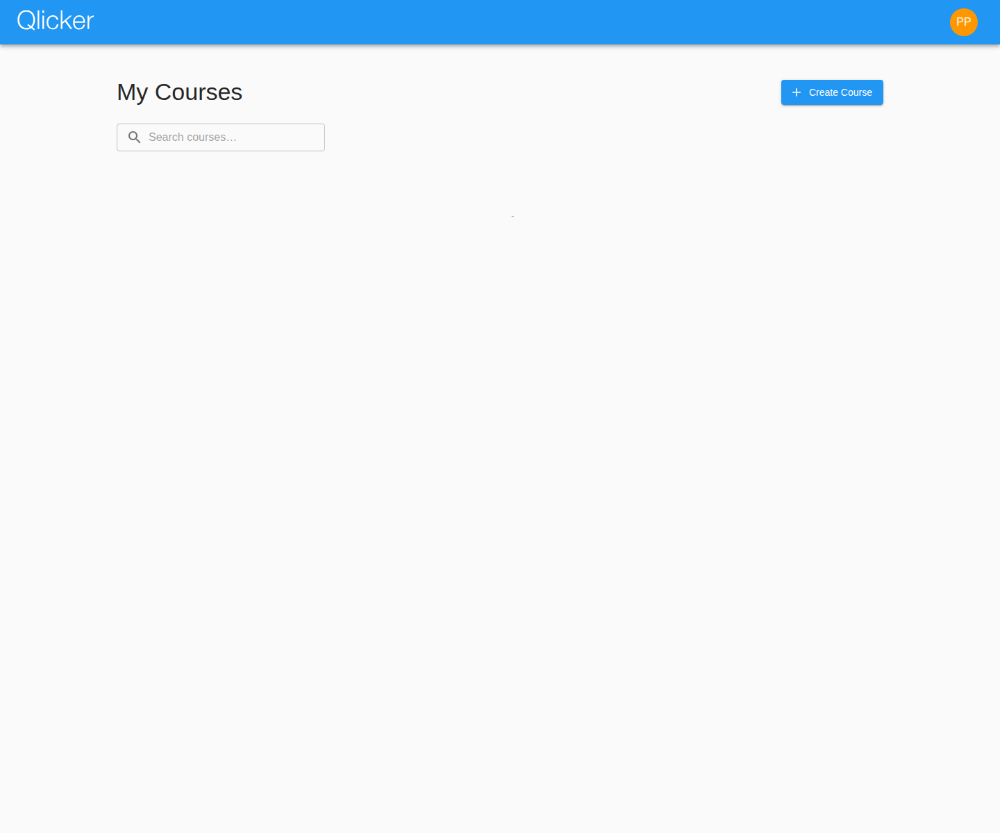
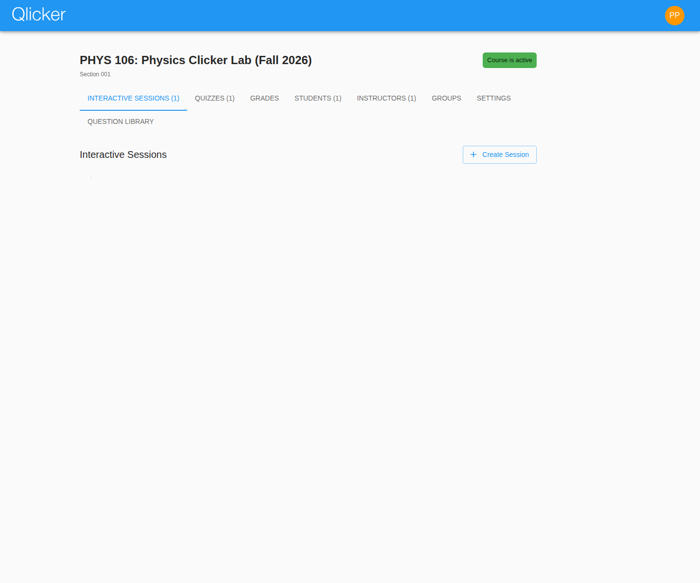
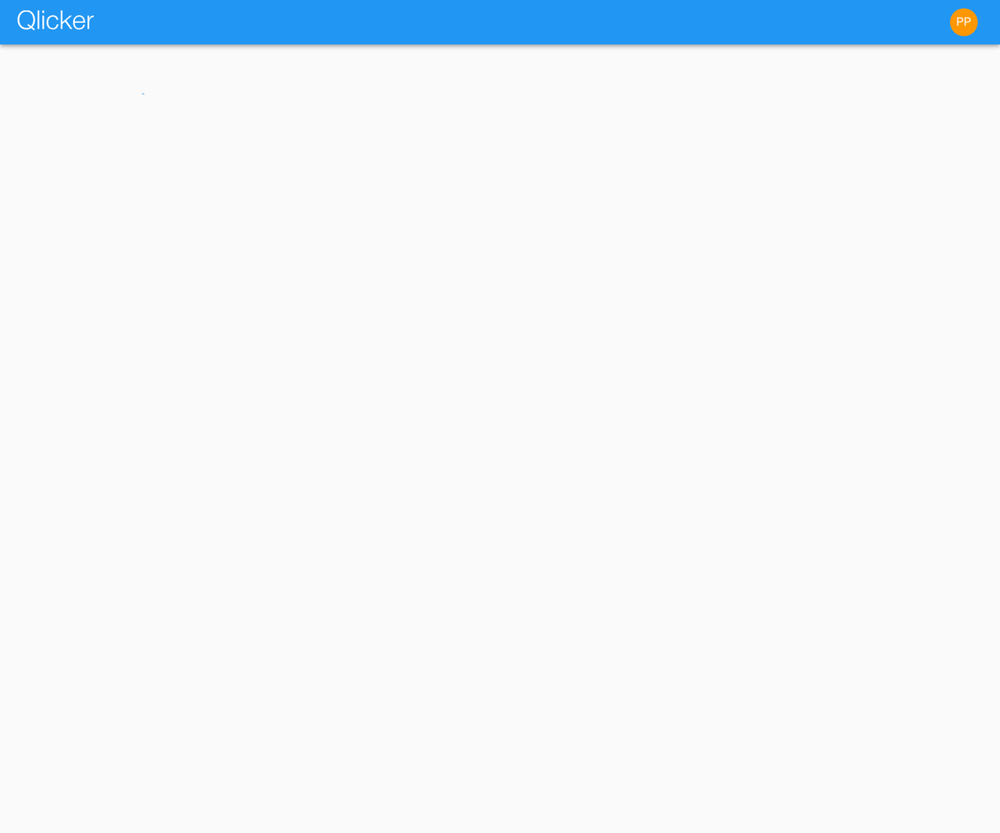

# Professor User Manual

Use this guide to create courses, organize content, build sessions, run live teaching or quizzes, review results, and grade student work in the current Qlicker app.

## At a glance

- **Best starting page:** professor dashboard
- **Best preparation habit:** add course topics before building lots of questions
- **Best review habit:** open review and grading immediately after an activity while the context is still fresh
- **Related guides:** [Student manual](student.md), [Admin manual](admin.md), [Grading guide](grading.md)

## Table of contents

1. [Professor dashboard](#professor-dashboard)
2. [Create and organize a course](#create-and-organize-a-course)
3. [Manage students, instructors, and groups](#manage-students-instructors-and-groups)
4. [Build sessions and quizzes](#build-sessions-and-quizzes)
5. [Use the question library and reuse tools](#use-the-question-library-and-reuse-tools)
6. [Run live sessions](#run-live-sessions)
7. [Review results and grade consistently](#review-results-and-grade-consistently)
8. [Troubleshooting checklist](#troubleshooting-checklist)

## Quick start checklist

1. Create the course with a clear title and a semester label you will reuse consistently.
2. Add course topics before you import or write many questions.
3. Confirm enrollment rules and share the current course code with students.
4. Set up groups before class if you will use them for organization or grading.
5. Build sessions from the course page and decide whether each one is live, quiz-based, or practice-oriented.
6. Review results and recalculate grades after the activity if scoring or manual marks changed.

## Professor dashboard

The professor dashboard is your command center for course setup and day-to-day teaching work.

From the dashboard you can:

- open existing courses
- create new courses
- search by code, title, section, or semester
- spot active or recent courses quickly
- return to the in-app manual without losing access to your course list

**Recommended habit:** keep a consistent semester naming scheme such as `Fall 2026` or `Winter 2027`. It makes searching, copying, and comparing courses much easier later.

## Create and organize a course

Most teaching work happens from the course page once the course exists.

The course workspace combines:

- interactive session lists
- quiz lists
- review and grade access
- student and instructor management
- groups
- course chat when enabled
- video settings when enabled
- course settings
- the course question library

The session and quiz lists now keep search, status filters, page size, and pagination inside a collapsible **Search sessions** area so the list itself can stay compact.
If the course currently has running activities, matching live tiles appear above the tabs so you can reopen the active session or quiz review flow without returning to the dashboard.

### Recommended setup order

1. Confirm the title, code, section, and semester.
2. Add course topics so questions can be tagged consistently.
3. Review course settings such as enrollment rules, active state, course chat retention, and whether students should have access to practice questions, practice sessions, and the course question library.
4. Share the current enrollment code with students.
5. Add instructors or TAs before the term begins.

### Course settings to verify early

| Setting | Why it matters |
| --- | --- |
| Enrollment code | Students need it to join the correct course |
| Active state | Inactive courses confuse students and hide workflows you may expect to see |
| Allow students access to practice questions | Controls whether students can see the course question library or build practice sessions |
| Course chat | Controls whether the course page shows a persistent course-wide discussion tab and how long posts stay visible before auto-archive |
| Topic list | Affects tagging, search, and reuse across the course |
| Video availability | Controls whether Jitsi/video workflows appear in the course |

## Manage students, instructors, and groups

### Students

Students usually enroll themselves with the course code, but the Students tab is still important for support work.

Use it to:

- search students by name or email
- confirm whether a student is actually enrolled
- remove a student from the course when needed
- inspect details when troubleshooting access or grades

### Instructors and TAs

Use the Instructors tab to add other teaching staff. Shared teaching staff can help with course workflows, but course ownership and institution-level admin permissions still matter for some settings.

If a student-only account is placed in a course's instructor list, Qlicker presents that membership as **TA** in the UI. That user can run sessions and grade in the courses they teach, but they still cannot create new courses unless their global role is professor or admin.

### Groups

Groups are course-specific and are easiest to manage before class begins.

Use the Groups tab to:

- create a group category
- choose how many groups it contains
- rename groups with meaningful labels
- move students between groups
- import or export group assignments as CSV

Groups are especially useful when:

- different TAs grade different student subsets
- you want breakout or discussion organization before class
- participation or review analysis depends on the same grouping later

## Build sessions and quizzes

Sessions in the current app are ordered teaching flows. They can mix slides and response-collecting questions.

From the session editor you can:

- set the session name and description
- choose whether the activity is interactive or quiz-based
- require a passcode or join code
- set quiz start and end dates
- add quiz extensions
- choose the multiple-select scoring method
- insert slides anywhere in the order
- add questions from the library or create them inline
- export and import session JSON
- open print and PDF-friendly views

### Question types supported in the current app

- multiple choice
- true / false
- multi-select
- short answer
- numerical
- slides (content-only items inside sessions)

### Strong session-building habits

- Use slides before or between questions when students need instructions, context, or worked examples.
- Keep tags aligned with course topics so search and reuse stay clean.
- Check visibility before copying questions into a new context.
- Before publishing a quiz, verify the dates, reviewability setting, and final ordering.
- If a question already has response data, expect some edits to be restricted to protect past results.

### Session list navigation

- The course page shows the first batch of sessions quickly, then loads the remaining session cards in the background.
- Open **Search sessions** when you need search, status filtering, or pagination controls; collapse it again when you want more room for the cards.
- Session cards can show a **Needs grading** chip when manual work remains.
- Empty short-answer submissions still count for participation, but they no longer keep the session flagged as needing grading.
- Professor session cards also show the number of joined students when the session has participation data.
- Quiz cards now show the most relevant timestamp directly in the list: **starts at** for upcoming quizzes, **ends at** for live quizzes, and **ended at** for finished quizzes.
- Clicking the main body of a live interactive-session card opens the live controls directly.
- Clicking the main body of a live quiz session still opens the session editor.
- Clicking the main body of a session card opens the session editor while the session is still draft or upcoming.
- Clicking the main body of an ended session card opens the review page instead, so grading and post-session analysis are one tap away.
- Live session cards now include a **Review Live Session Results** button for both interactive sessions and quizzes.
- Draft or upcoming session cards only show a separate **Review** button after at least one question in that session has collected responses.

## Use the question library and reuse tools

The question library helps with both preparation and reuse.

Use it to:

- search by keyword, type, tags, or visibility
- copy questions into a session
- bulk update visibility for selected questions
- import or export JSON bundles
- review student-submitted material when that workflow is enabled

### Reuse checklist

Before reusing or copying content, verify that:

- the destination course topics still match the copied tags
- quiz dates are still valid
- session-specific visibility and review settings still make sense
- any passcode or release expectations match the new activity

## Run live sessions

Interactive sessions are designed for instructor-paced teaching.

### Typical live-session workflow

1. Launch the session from the course page.
2. Confirm whether join codes or passcodes are required.
3. Move between questions with the navigation controls.
4. Open or close responses for each attempt.
5. Reveal statistics or correct answers when ready.
6. Start a new attempt if students should answer again.
7. End the session when the activity is complete.

### Session chat during live teaching

- Use **Enable session chat** above the live-session tabs when you want students to send live feedback.
- The live controls, the presentation window, and the student interface each gain a **Chat** tab while chat is enabled.
- Students can write rich-text posts and comments with the same math and image support used in short-answer responses.
- Student posts stay anonymous to the class, but the professor view and the session review tab still show the student names.
- Students can use quick posts for **I didn't understand question i** on earlier questions; repeated quick posts raise the same post's upvote count instead of creating duplicates.
- In the professor chat tab, use **Dismiss** to remove a post from the student and presentation views while still keeping it in the professor-only session review tab.

### Course chat on the course page

- In the course **Settings** tab, enable **Course Chat** when you want a persistent discussion space outside individual live sessions.
- Once enabled, the course page gains a **Course Chat** tab for instructors, students, and TAs.
- Each post needs a topic, can include course tags, and supports rich text with images, equations, and video embeds.
- Students stay anonymous to other students, while the professor/TA view shows the student avatar, name, and email for posts and comments.
- Use the tag filter to narrow the list, and in the instructor view you can also filter by the student who created the post.
- Students can delete only their own posts/comments, while instructors can archive or delete posts and can delete any comment.
- Comments from the same person who created the post are marked as **Original poster**.

### Live teaching tips

- Watch for whether the active item is a **slide** or a **question**. Slides do not collect answers.
- Use the presenter and second-display windows when you need a cleaner classroom display.
- If students report that they can open the session but cannot answer, first check whether responses are currently enabled.
- If statistics are meant to stay hidden until discussion time, reveal them only after the class has committed to answers.
- For short-answer questions, the professor control view always keeps the full response list visible. Use the toggle above that list when you want to hide or reveal the shared response list for students and the presentation window without changing the word cloud.

## Review results and grade consistently

After a session or quiz is complete, open the review page to inspect outcomes.

The review workflow helps you:

- inspect response counts and distributions
- review per-question outcomes
- move into grading workflows
- confirm that student participation matches expectations

Session review also includes a few recent usability improvements:

- the results tab shows the student's actual session grade before the participation column
- clicking a student's avatar in the Students tab opens the larger profile photo
- question entries opened from the course-grade table now show `Q1(MC)`, `Q2(SA)`, and similar type labels with visual cues for whether grading is still required
- sessions that used live chat now include a **Chat** review tab with the full post and comment history, including dismissed posts and upvote counts

Qlicker supports both automatic and manual grading.

For live interactive sessions, you can open the review page while the session is still running to watch results accumulate. The grading interface stays locked until the session reaches **Ended**.
Using **End Session** from the live controls now stamps the session with the actual time it was ended, which keeps later review and reporting timestamps aligned with what happened in class.

Use the grading workflows to:

- recalculate grades for one session or many sessions
- inspect each student's marks
- resolve manual-vs-automatic grading conflicts
- edit feedback and point values
- export course grades to CSV

Important grading rule: the grading interface is intentionally locked while a session is live. End the session first. Grade items are created when the session reaches **Ended**, and making the session reviewable later only controls whether students can see those grades.

From the session-review grading tab you can also change how many points a question is worth. Qlicker warns before proceeding because that action triggers a full session grade recalculation. Any marks that were manually assigned stay preserved.

When you open a question from the grade table, the detail dialog lets you edit the manual mark directly from that question view. The question rows and nested dialog titles now include the question number plus type, such as `Q1(MC)` or `Q2(SA)`, and use red/green grading cues that ignore stale zero-point grading flags.

Short-answer questions typically require manual grading, while many objective question types can be autograded.

See also the dedicated [grading guide](grading.md).

## Profile and account settings

From the account menu you can update your language, profile details, password, and avatar.

Keep in mind:

- uploading a profile picture opens a crop/rotate dialog so you can choose the square avatar thumbnail
- when institution-wide SSO is enabled, name and password fields stay locked unless an administrator has granted your account the email-login exception
- password-reset email follows the same rule: if the account is SSO-managed without that exception, use the SSO sign-in route or contact an administrator

## Troubleshooting checklist

### Students cannot join the course

Check:

- the current enrollment code
- whether verified email or SSO is required
- whether the student is already enrolled under another account
- whether the course is active and visible from the student workflow

### Students can open the session but cannot answer

Check:

- whether responses are currently allowed
- whether the active item is a slide rather than a question
- whether the join or passcode settings changed
- whether the session is still running

### Grades do not look correct

Check:

- the session scoring settings
- whether manual marks intentionally override autograding
- whether recalculation is needed after question edits or late grading work
- whether the multiple-select scoring method explains the result

## Related manuals

- [Student user manual](student.md)
- [Admin user manual](admin.md)
- [Grading guide](grading.md)
