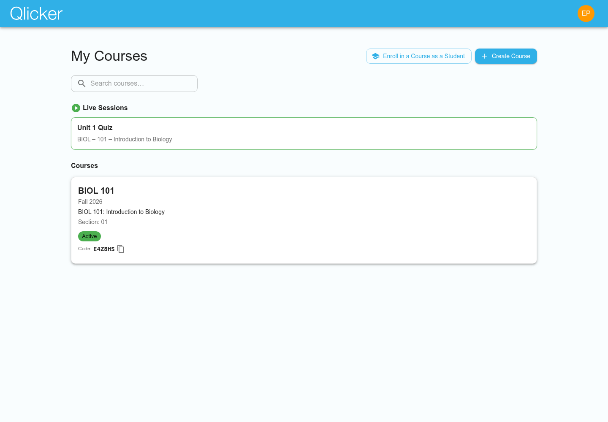
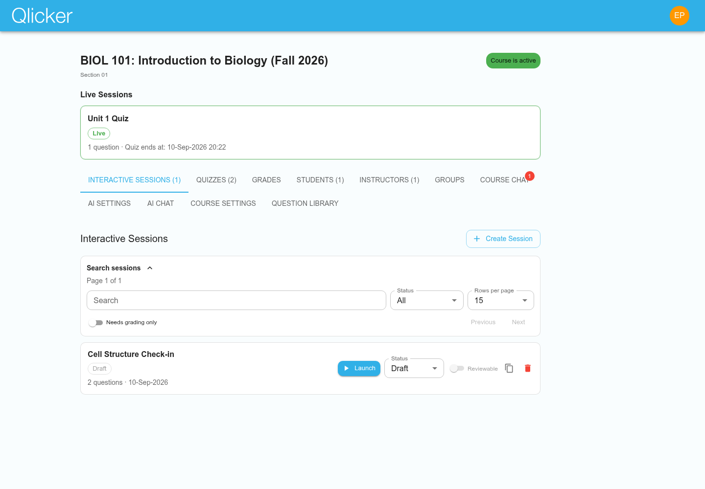
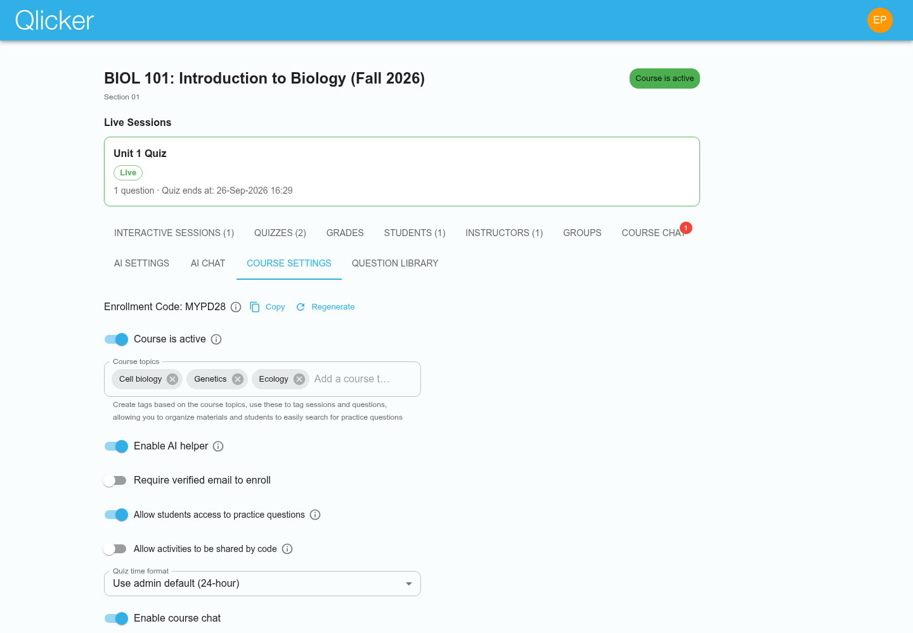
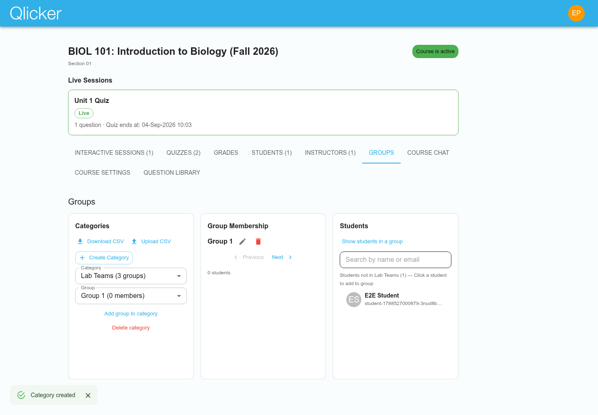
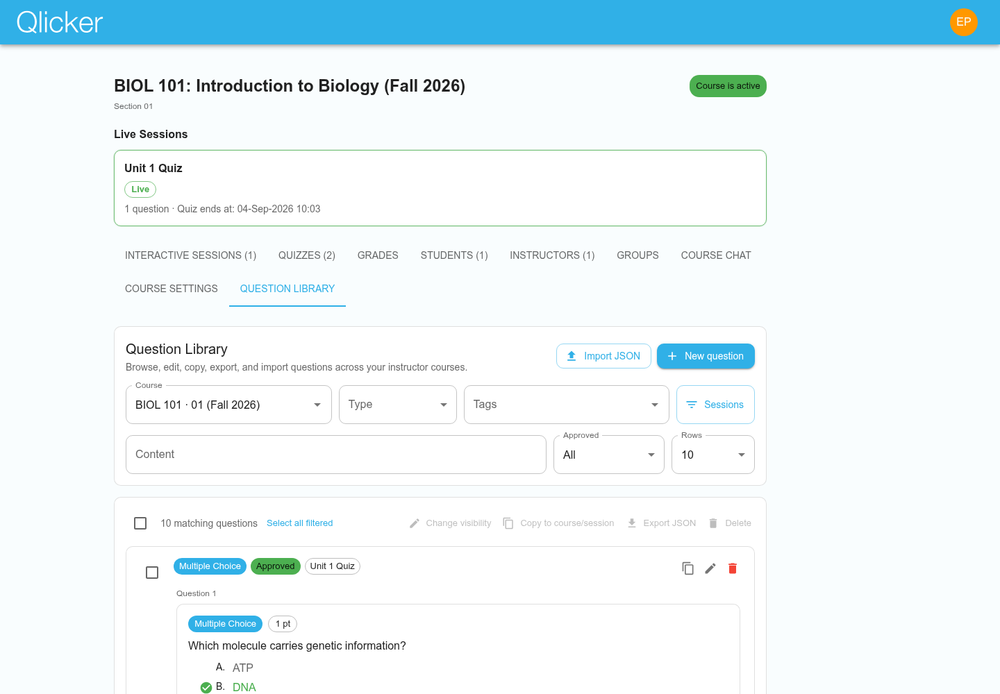
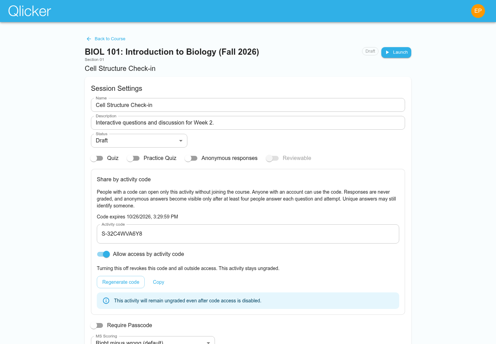
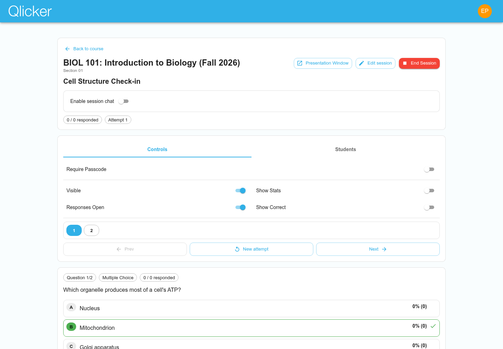
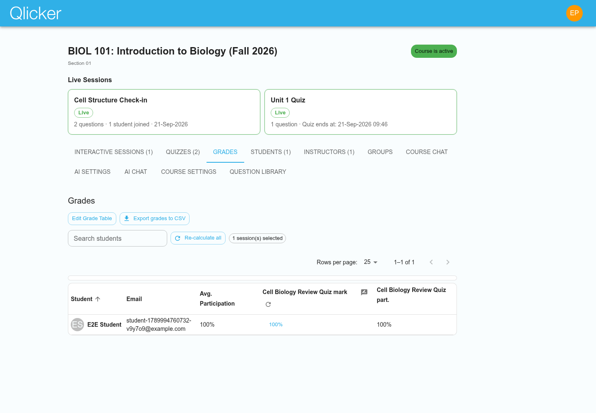

# Professor and TA User Manual

Use this manual to build courses, manage people and reusable content, teach live, run quizzes, review responses, and publish grades. A TA assigned as a course instructor uses the same course workspace; some account-wide actions depend on the person's global role.

If this is your first visit, read [Getting started](getting-started.md) first.

## Contents

1. [Understand the professor dashboard](#1-understand-the-professor-dashboard)
2. [Create and configure a course](#2-create-and-configure-a-course)
3. [Manage students, instructors, and notices](#3-manage-students-instructors-and-notices)
4. [Create and manage groups](#4-create-and-manage-groups)
5. [Build a reusable question library](#5-build-a-reusable-question-library)
6. [Create an interactive session](#6-create-an-interactive-session)
7. [Configure and deliver a quiz](#7-configure-and-deliver-a-quiz)
8. [Run an interactive class](#8-run-an-interactive-class)
9. [Use course chat, session chat, video, and AI](#9-use-course-chat-session-chat-video-and-ai)
10. [Review a session and grade students](#10-review-a-session-and-grade-students)
11. [Copy, import, export, and prepare the next term](#11-copy-import-export-and-prepare-the-next-term)
12. [Common teaching scenarios](#12-common-teaching-scenarios)
13. [Troubleshooting](#13-troubleshooting)

## Quick start for a live class

1. Create the course and share its enrollment code.
2. Add course topics and confirm the course is active.
3. Create a session, add questions/slides, and check point values and visibility.
4. Launch the session, optionally open the join period/passcode, and make the first question visible.
5. Open/close responses, show statistics or the answer when useful, and move through the pages.
6. End the session, review results, finish manual grading, and make it reviewable when students should see it.

## 1. Understand the professor dashboard

After sign-in, the professor dashboard shows courses you own or teach and highlights currently live activities. Use a course card to open its workspace. Use **Create Course** for a new course shell.

The dashboard is intentionally a launch point, not the place where most configuration happens. Open a course to reach sessions, quizzes, grades, rosters, groups, chat, course settings, and the question library.

### Course naming convention

Choose a convention that stays meaningful after content is copied. A useful pattern is:

- department and number: `BIOL 101`
- descriptive name: `Introduction to Biology`
- section: `01`
- semester: `Fall 2026`

Consistent semester labels make old courses and copied content easier to identify.

## 2. Create and configure a course

### Create the course

1. Select **Create Course** from the dashboard.
2. Enter the course name, department code, number, section, semester season, and year.
3. Select **Create**.
4. Open the new course card.

The course workspace places the major tools in tabs. Live activities also appear above the tabs for faster access.

### Configure course settings

Open **Course Settings** and review every item before enrollment:

1. Copy the enrollment code and store it where students can find it.
2. Keep the course active while students need to enroll or work in it.
3. Add course topics. Topics are used for organization and chat/question-library filtering.
4. Decide whether verified email is required for enrollment (when local authentication is enabled).
5. Enable student access to practice questions only when they should see the practice and question-library tabs.
6. Choose whether quiz times inherit the site default or use a course-specific 12/24-hour display.
7. Enable course chat and select its retention period if discussion will be used.
8. Review the editable course name, code, section, and semester.

Settings autosave after changes. Wait for the saved state before navigating away.

### Rotate an enrollment code

Use **Regenerate** beside the code when an old code should no longer admit new students. Already enrolled students remain enrolled. Share the new code only with the intended class.

### Archive or delete

Make a course inactive when it should no longer accept enrollment or appear as current work. Deleting a course is much more consequential; prefer inactivation for completed terms unless the records truly should be removed.

## 3. Manage students, instructors, and notices

### Students

Open **Students** to inspect the roster. Depending on your permissions, you can add or remove a student and open notification management for the course.

Before removing someone, confirm that the email/user ID is correct and consider the effect on access to past work. Their underlying responses and grades may still be retained for academic records.

### Instructors and TAs

Open **Instructors** to add another instructor by user ID or email and remove instructors who no longer teach the course. A student-role account assigned as an instructor is displayed as a TA in relevant interfaces; this label does not create a separate stored global role.

Never remove the last person responsible for the course without arranging ownership/support access.

### Course notices

Use **Manage notifications** from the Students or Instructors area to publish notices visible in the app's notification menu. Use this for Qlicker-specific messages such as a changed quiz window or a planned outage. It does not send email.

When creating a notice:

- make the title actionable
- state the affected course/activity
- include the relevant date/time and time zone
- set an expiry so old alerts do not remain indefinitely

## 4. Create and manage groups

Groups are organized into categories. A student can belong to one group within a category, while the course can have several categories (for example, **Lab Teams** and **Project Teams**).

### Create a category manually

1. Open **Groups**.
2. Select **Create Category**.
3. Enter a category name and number of groups.
4. Select **Create**.
5. Rename groups when descriptive names are more useful than Group 1, Group 2, and so on.
6. Select students to assign them, then verify that nobody is unintentionally unassigned.

### Import or export groups

- Select **Download CSV** to save the current structure as a roster reference or editing template.
- Select **Upload CSV**, name the destination category, paste/upload the required CSV content, and review the import summary.
- Fix unknown/duplicate email addresses before using the groups for class activities.

Export again after a large change so you have a human-readable record of the final assignments.

## 5. Build a reusable question library

The **Question Library** contains questions you can search, tag, export, copy, and add to sessions.

### Question types

| Type | Use it for | Grading behavior |
| --- | --- | --- |
| Multiple Choice | One correct option | Automatically graded |
| True/False | A binary claim | Automatically graded |
| Multi-Select | One or more correct options | Automatically graded using the session's selected scoring method |
| Numerical | A number with optional tolerance | Automatically graded |
| Short Answer | Written reasoning or explanation | Usually requires manual grading |
| Slide | Instructions, worked examples, images, or transitions | Not answerable or graded |

### Author a good question

1. Choose the type before building the response options.
2. Write a prompt that is understandable without spoken context.
3. Mark correct choices or enter the correct numerical value/tolerance.
4. Add a solution/explanation; students see it only when the workflow releases it.
5. Add course topics/tags.
6. Set visibility deliberately.

Use the rich-text editor for equations, images, lists, links, color, and code only when they improve comprehension. Preview mathematical notation and verify image alternative/context in the surrounding prompt.

### Visibility levels

Keep assessment content private unless it is intended for reuse or student practice. Course-visible and Qlicker-wide visibility can expose a question outside the session where it was first authored. Student library access also depends on the course's **Allow students access to practice questions** setting.

### Library bulk actions

Use filters and **Select all filtered** carefully: bulk export/copy acts on the matching selection, not necessarily only the items currently visible on one page. After copying to another course or session, inspect the copied version's tags, point value, and solution.

## 6. Create an interactive session

### Create the shell

1. Open **Interactive Sessions**.
2. Select **Create Session**.
3. Give it a specific name and description.
4. Open the session card to enter the editor.

### Build the ordered flow

In the session editor you can create a new question, add from the library, insert a slide, import JSON, and move pages up/down. Questions copied into a session become session-specific copies, so later session settings do not change the original library item.

For each question, review:

- point value (short answer defaults may differ from objective questions)
- maximum attempts and attempt weights
- correct answer/solution
- tags and visibility
- whether response data already exists, which can restrict editing to protect historical results

Use **Set all question points** only after considering ungraded slides and deliberately zero-point participation questions.

### Session-level controls

- **Status** controls whether the activity is hidden/draft, visible, running, or ended.
- **Reviewable** controls whether students can later see review/grades; it is not the same as ending the session.
- **Join code/passcode** and refresh interval provide controlled entry for live activities.
- **Multi-select scoring** applies to multi-select questions in the session.
- Session tags help organize and apply tags to questions.

Do a student-view rehearsal before a high-stakes activity. Confirm the session appears on the intended tab and that solutions are not exposed early.

## 7. Configure and deliver a quiz

Create a session, enable quiz mode, and configure its window. A normal quiz is student-paced during the availability period; a practice quiz is intended for lower-stakes rehearsal.

### Before publishing

1. Set the start and end time and confirm the course's 12/24-hour preference.
2. Add all questions and check the order, points, solutions, and multi-select method.
3. Add per-student extensions/accommodations where needed.
4. Make the quiz visible only when the listing should appear.
5. Preview with a non-instructor test account if the assessment is high stakes.

### During the window

Students' answers save while they move through the quiz. The course/dashboard cards show the relevant start/end time. Submitted normal quizzes cannot be edited again. Avoid editing question meaning or scoring while students are actively answering.

### After the window

End the quiz/session, recalculate grades, complete manual grading, and enable **Reviewable** only when answers and feedback should be released. A submitted quiz is excluded from the student's live quick-access area even if the overall window remains open.

## 8. Run an interactive class

Select **Launch** on an interactive session. The professor control view is separate from the student and presentation views.

### Recommended sequence

1. Open the optional presentation window on the classroom display.
2. Enable the join period. If a rotating join code is required, display it and wait for students.
3. Admit waiting students manually when appropriate.
4. Close the join period when enrollment is stable.
5. Select the intended page and turn on **Visible**.
6. Open the response attempt; watch joined/responded counts.
7. Close responses before discussing results.
8. Show statistics and/or the correct answer when pedagogically useful.
9. Start another attempt or move to the next page.
10. Select **End Session** and confirm when class is finished.

### What each audience sees

- The professor always sees control information and, for short answer, the response list needed to moderate the class.
- Students see only pages, statistics, correct answers, and shared short-answer lists that you have revealed.
- The presentation window follows the public classroom state without the professor's management controls.

Statistics include option distributions, word clouds for suitable short answers, and histograms for numerical responses. The shared short-answer response list can be hidden separately from its word cloud.

### Multiple attempts

Open a new attempt when students should answer again after discussion. Attempt weights/max attempts affect grading, so set them before class and explain the policy. Live response totals should be interpreted per current attempt.

## 9. Use course chat, session chat, video, and AI

### Course chat

When enabled in course settings, **Course Chat** supports topic-based posts and comments. Rich text can contain images, equations, and links. Student authors are anonymous to other students but identifiable to instructors/TAs.

Moderate inaccurate or inappropriate material, respond where the whole class benefits, and use topic tags so discussions remain searchable. Retention follows the course setting.

### Session chat

Enable chat from live controls when the activity benefits from a parallel question channel. Students can post/comment, upvote useful items, and use quick posts such as “I didn't understand question 2.” Instructors can reply, dismiss items from the active queue, and review the complete history—including dismissed posts—after the session.

### Video

If an administrator enabled Jitsi and the course is configured for it, the Video tab/window provides course or group meeting entry. Test the institution's Jitsi domain, microphone/camera permissions, and group assignments before relying on it in class.

### AI helper and AI chat

AI tabs appear only when an administrator has authorized backends/models and the course enables them. Course settings can control the default models, student availability, guidance, maximum tool rounds, and reusable grading/feedback/summary rubrics.

AI output can be wrong. Review generated sessions, questions, summaries, grades, and feedback before using or publishing them. Do not put protected student information into an external model unless institutional policy and the configured backend permit it.

## 10. Review a session and grade students

Open **Review** from a completed session/quiz card. A running interactive session may be reviewed for monitoring, but grading remains locked until the activity is ended.

Review tabs can include result summaries, per-question response data, students, grading, and chat history. Use them to answer different questions:

- **Results/response data:** What did the class choose or write?
- **Students:** Who joined, submitted, or needs follow-up?
- **Grading:** What was autograded, what needs manual work, and what conflicts exist?
- **Chat:** What questions/comments occurred during the session?

### Course grade table

Open the course **Grades** tab, choose **Show Grade Table**, select sessions, and show the table. Select a percentage cell to inspect the student's grade; select a question label such as `Q1(SA)` to grade that response.

### Safe grading sequence

1. End the session.
2. Recalculate grades if scoring/content changed or results have not been seeded.
3. Manually grade short answers and other flagged work.
4. Add concise, actionable feedback.
5. Resolve automatic-versus-manual conflicts deliberately; recalculation preserves manual overrides.
6. Confirm the overall percentage and point totals.
7. Enable reviewability/grade visibility when release is intended.
8. Export CSV for your external gradebook and inspect the file before importing it elsewhere.

Changing a question's point value from review triggers a full session recalculation after confirmation. Existing manual marks remain preserved. For the detailed calculation and visibility rules, use the [Grading guide](grading.md).

## 11. Copy, import, export, and prepare the next term

### Sessions

- Copy one session from its card, or use the multi-session copy workflow.
- Choose a destination course and decide whether point values should be preserved.
- Review dates, passcodes, status, reviewability, tags, and visibility in the destination.
- Export JSON for transfer/backup of editable content; use PDF/print output when a human-readable version is needed.

### Questions

- Export selected library questions to JSON.
- Copy selected questions to another course or session.
- Import JSON, review the item count, then inspect every imported question.

Content exports are not a substitute for database backups: they do not contain all enrollment, response, grade, settings, and account data.

### End-of-term checklist

1. Finish grading and export the final grade view.
2. Confirm required review access for students.
3. Download useful group/question/session exports.
4. Ask an administrator to confirm backup health.
5. Make the old course inactive rather than deleting it.
6. Copy only the content needed for the new course and reset all dates/visibility.

## 12. Common teaching scenarios

### Anonymous muddiest-point discussion

Create a short-answer question, enable session chat, ask students what remains unclear, and generate a word cloud after closing responses. Keep the response list hidden from the student/presentation view if individual phrasing could be sensitive.

### Peer instruction with two attempts

Configure two attempts, collect the first answer without revealing the solution, show the distribution, let students discuss, then open the second attempt. Reveal the answer/explanation only after the second response window closes.

### Accommodated timed quiz

Configure the common quiz window, add the student's extension in the session editor, verify the resulting individual end time, and avoid changing the base window once submissions begin.

### Student self-study set

Enable student practice access, publish only suitable library questions, tag them by topic, and ask students to build a practice session. Keep future exam questions private.

### Group-supported class

Import or assign group membership before class, verify every student, enable video only if needed, and export the final group roster. Group categories are course-specific even when sessions are copied.

## 13. Troubleshooting

### A student cannot enroll

Check that the course is active, the current enrollment code was entered exactly, verified-email policy is satisfied, and the student is using the intended account. Regenerating a code invalidates older codes.

### A student cannot see practice or library tabs

Enable **Allow students access to practice questions** in Course Settings. Then confirm the questions themselves have student-appropriate visibility.

### A student cannot answer live

Check session status, join/admission state, page visibility, current response attempt, and whether the current page is a slide. If a join code rotates, make sure the student used the current value.

### A quiz appears closed

Check the base start/end values, the student's extension, course time format, and the server/deployment time zone. Confirm whether the student already submitted.

### Results or grades look wrong

End the session, verify question points/answers and multi-select method, recalculate, then inspect manual overrides and the student's latest attempt. Very low participation on a single-attempt question can affect grading rules; see the [Grading guide](grading.md).

### A copied activity has the wrong behavior

Copied content can retain settings that are unsuitable for the destination. Recheck course topics, status, reviewability, dates, points, join code settings, extensions, and question visibility before launch.

### Live updates appear stuck

Check the browser network and reload the affected view once. If several users are affected, contact the administrator with the course, session, approximate time, and whether the problem affected professor, student, presentation, or all views.

## Related guides

- [Getting started](getting-started.md)
- [Student manual](student.md)
- [Grading guide](grading.md)
- [Admin manual](admin.md)
