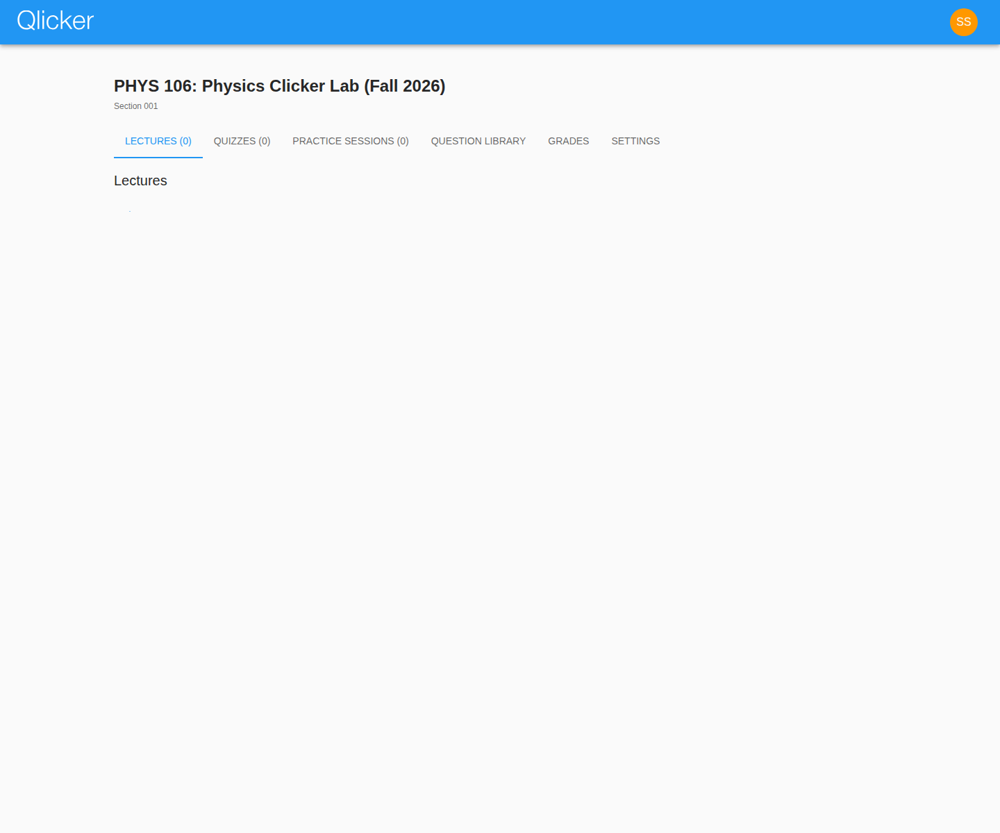
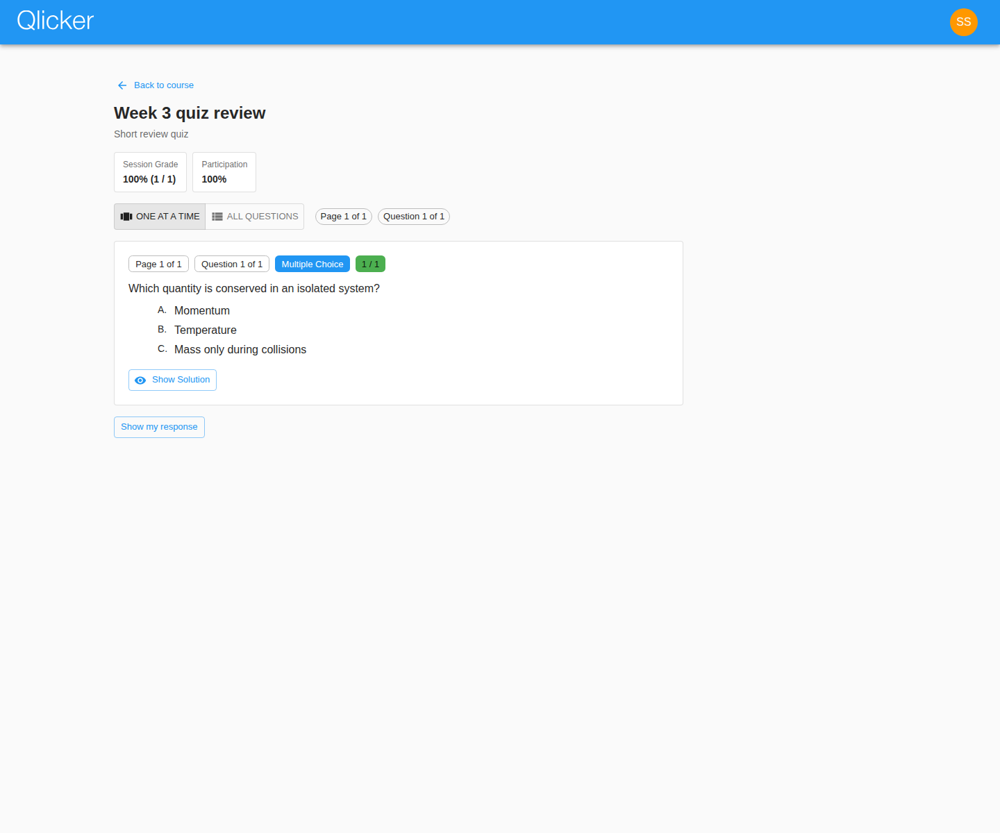

# Student User Manual

Use this guide to enroll in courses, join live sessions, complete quizzes, review feedback, and build practice sessions in the current Qlicker app.

## At a glance

- **Best starting page:** your course page
- **Best study habit:** return to reviewable sessions after class and compare your answer with the released explanation
- **Best self-study tool:** practice sessions built from visible library questions
- **Related guides:** [Professor manual](professor.md), [Admin manual](admin.md), [Grading guide](grading.md)

## Table of contents

1. [Dashboard and enrollment](#dashboard-and-enrollment)
2. [Understand the course page](#understand-the-course-page)
3. [Join live sessions](#join-live-sessions)
4. [Take quizzes](#take-quizzes)
5. [Review finished work](#review-finished-work)
6. [Build practice sessions](#build-practice-sessions)
7. [Grades, feedback, and profile settings](#grades-feedback-and-profile-settings)
8. [Troubleshooting checklist](#troubleshooting-checklist)

## Quick start checklist

1. Log in with your Qlicker account or institution SSO.
2. Enter the course code supplied by your instructor.
3. Open the course page and choose the correct tab for the task you need right now.
4. Return to reviewable sessions and practice sessions after class to study from feedback.

## Dashboard and enrollment

The student dashboard is the starting point for every course.

From the dashboard you can:

- see every course in which you are enrolled
- enter a new course code to join another course
- return to course work without searching through older pages

### Enrollment tips

- Enter the course code exactly as your instructor provided it.
- If the course is inactive, enrollment is rejected immediately. You will need to try again after the instructor or admin activates the course.
- If your institution requires verified email or SSO, finish that setup before assuming the code is wrong.
- After you join successfully, the course stays on your dashboard until you are removed or the course is archived for your account.

## Understand the course page

The course page separates each type of work into tabs so that live class work, quizzes, review, practice, and grades do not get mixed together.

On the course page you will typically see:

- **Lectures / live sessions** for instructor-led interactive sessions
- **Quizzes** for timed assessments
- **Practice sessions** for self-study and rehearsal
- **Question library** for visible study questions and question-based practice workflows
- **Grades** for your own course and session results
- **Video chat** when your course has Jitsi enabled

If the instructor turns off **Allow students access to practice questions**, the **Practice sessions** and **Question library** tabs are hidden for that course. You can still review finished sessions and their released answers.

If a course has many sessions, the page shows the first batch of session cards quickly and continues loading the remaining session lists in the background.
Search, status, page-size, and pagination controls now live inside a collapsible **Search sessions** area so the session cards remain easier to scan.
When a course currently has a live activity, matching live tiles also appear above the tabs so you can jump into that course's active work immediately. Submitted live quizzes are excluded from that quick-access area.
Quiz cards now show the relevant date and time directly on the course page: upcoming quizzes show when they start, live quizzes show when they end, and ended quizzes show when they ended.

### How to choose the right tab

| If you want to… | Start here |
| --- | --- |
| join a class activity controlled by the instructor | live sessions / lectures |
| complete a scheduled assessment | quizzes |
| review answers and explanations later | reviewable session or quiz link |
| study on your own time | practice sessions or question library |
| check marks and feedback | grades |

## Join live sessions

Live sessions are used when an instructor is controlling the pace of the class.

### Typical workflow

1. Open the course page.
2. Select the live tile or live session card when it becomes available.
3. Enter the join code or passcode if required.
4. Wait for the current question or slide to appear.
5. Submit your answer once the instructor allows responses.

### Important live-session behavior

- Instructors can hide the question temporarily.
- Instructors can stop responses and reopen them for another attempt.
- Slides can appear between questions. Slides are content-only pages, so read them before moving on.
- Statistics and correct answers only become visible when the instructor turns them on.
- When statistics include a word cloud or histogram, those visualizations should appear automatically as soon as the instructor reveals them.
- For short-answer questions, your instructor can show or hide the shared response list separately from the word cloud, so you may see one without the other.
- If your instructor enables session chat, a **Chat** tab appears during the live session. You can write posts and comments with math and image formatting, and you can upvote posts that are helpful to the class.
- Student chat posts stay anonymous to classmates and the presentation screen, but they are still visible to the instructor.
- Quick-post buttons let you send **I didn't understand question i** for earlier questions without typing the whole message each time.

## Take quizzes

Quizzes differ from live sessions because they open during scheduled windows rather than following the instructor question by question.

### What to expect

- A quiz is available only during its configured time window unless you have an extension.
- Your responses save as you move through the quiz.
- Some deployments display one question at a time while others allow more navigation.
- Once submitted, a normal quiz cannot be edited again.

### Before you start a quiz

Check:

- the quiz start time
- the quiz end time
- any extension or accommodation that applies to you
- whether you are in a quiet environment with enough time to finish

## Review finished work

When an instructor marks a session or quiz as reviewable, you can return to study your answers and feedback.

Review pages are useful because they can show:

- your submitted answer
- the released correct answer
- the instructor's explanation or solution
- feedback on manually graded questions
- points and participation information

Live session chat stays out of the student review view. Posts and comments are only available while the live session is running.

### Best review habit

Move one question at a time. Compare:

1. what the question asked
2. what you submitted
3. what the released answer or solution says
4. what feedback tells you to improve next time

## Build practice sessions

Practice sessions are student-paced study sessions.

Use them when you want to:

- rehearse visible library questions on your own schedule
- create a short study set before a quiz or exam
- immediately review your results and try again

### Good practice workflow

1. Search the question library for the topic you want to revisit.
2. Add selected questions to a new practice session.
3. Complete the practice session.
4. Review the results immediately and repeat with another set if needed.

### Question library expectations

Student access to the library depends on what instructors have made visible.

If your course hides practice-question access entirely, you will not see the library or practice-session tabs at all.

The student library may include:

- questions shared with students in the course
- course-visible questions approved by instructors
- student-created material in practice workflows when allowed

Use the library to find practice material, not as a replacement for the course tabs. Live sessions and quizzes still begin from the course page.

## Grades, feedback, and profile settings

### Grades and feedback

The Grades tab shows only your own grades.

Keep in mind:

- a session usually must be reviewable before detailed results appear
- non-reviewable sessions may stay hidden from your student grade view
- feedback can arrive later if the instructor manually grades short-answer work after the activity

See also the shared [grading guide](grading.md).

### Profile and account settings

From the account menu you can:

- open your profile
- change supported profile fields
- update your password if your account is not managed by SSO
- change your preferred language when multiple locales are available

If your account is SSO-managed, your name and password may be locked intentionally unless an administrator has explicitly allowed email login for your account. In that case, password-reset email is also unavailable until the exception is granted.

When you upload a profile picture, Qlicker now opens an editor so you can drag the image, rotate it, and choose the square area used for your avatar circle.

## Troubleshooting checklist

### I cannot join a course

Check the following in order:

1. The course code was entered exactly as supplied.
2. Your account is verified if your institution requires verified email.
3. You are signing in through the correct route: email/password or SSO.
4. The instructor has not rotated the enrollment code since you received it.

### I cannot answer a live question

Possible reasons:

- the instructor has not opened responses yet
- responses have been disabled for the current attempt
- the instructor has moved to a slide or a different question
- the workflow does not allow another attempt after your first submission

### I cannot see my results

Possible reasons:

- the session is not reviewable yet
- manual grading is still in progress
- the instructor has hidden grades for that session

## Related manuals

- [Professor user manual](professor.md)
- [Admin user manual](admin.md)
- [Grading guide](grading.md)
