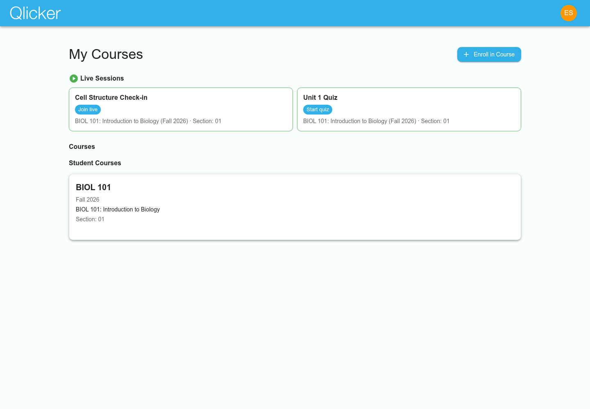
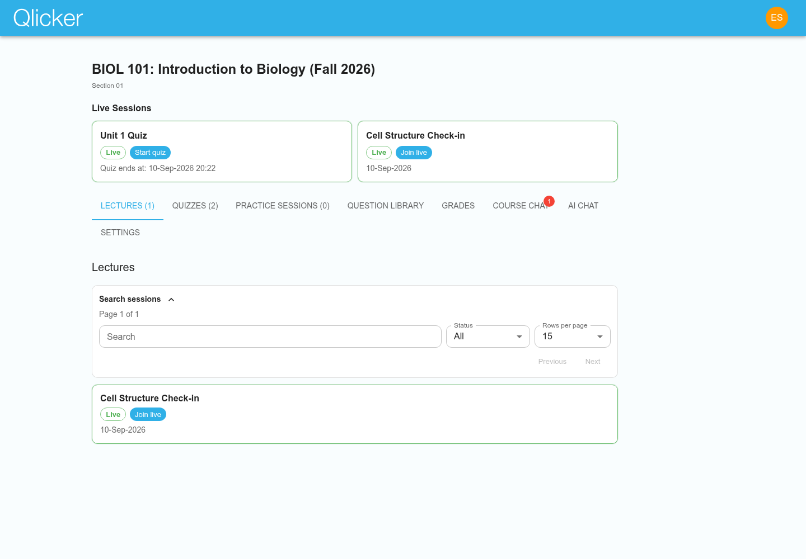
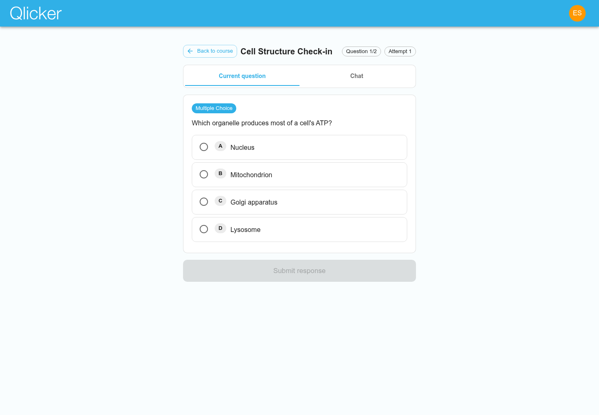
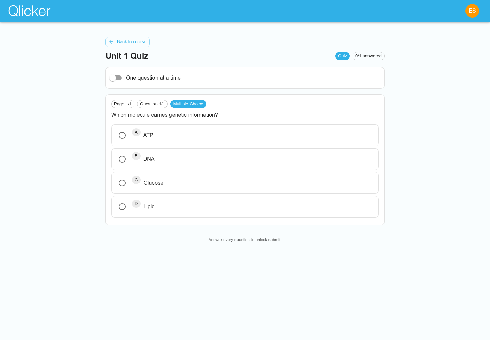
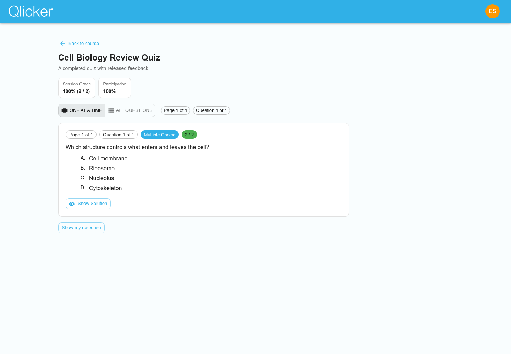
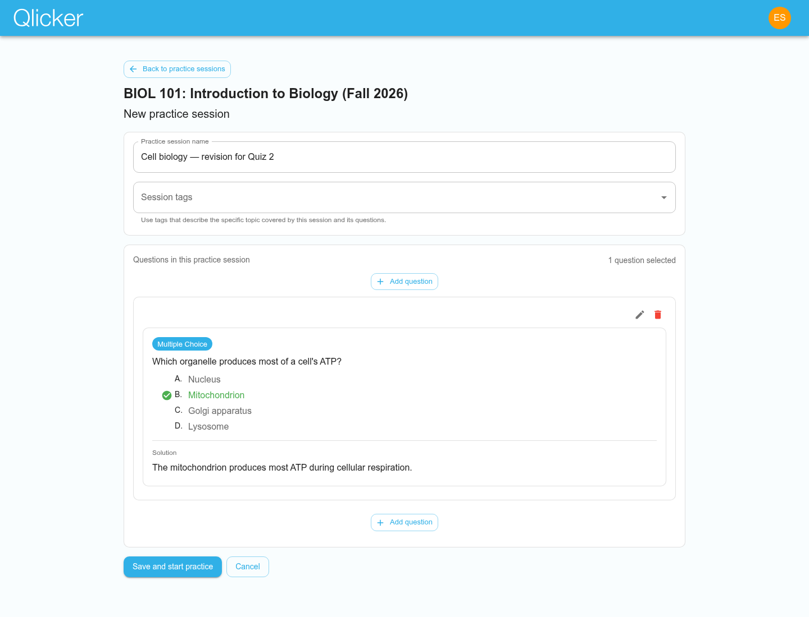
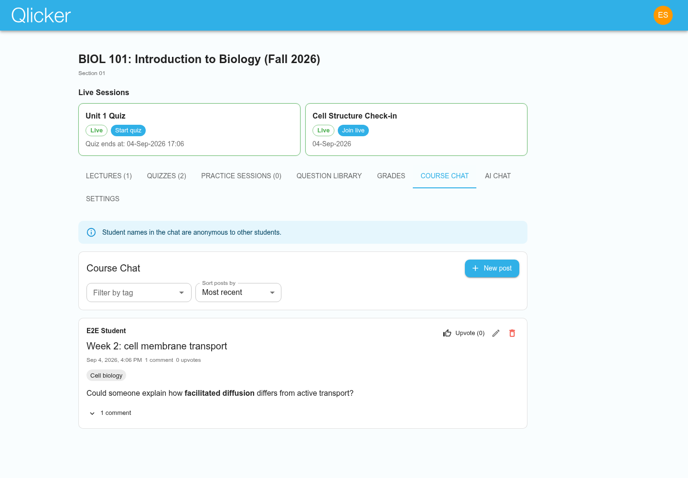
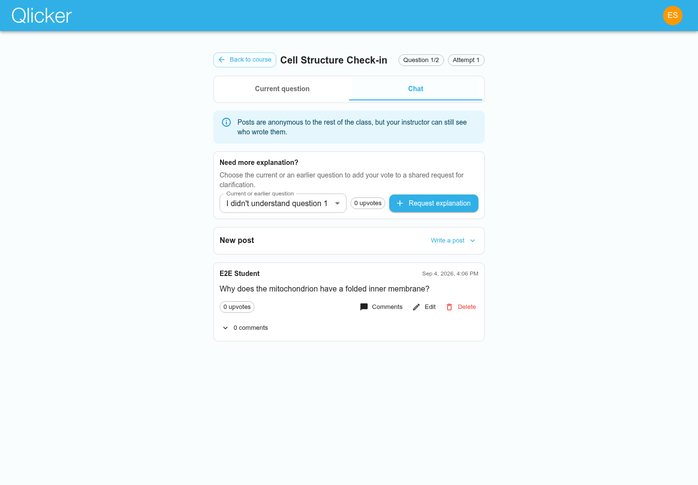
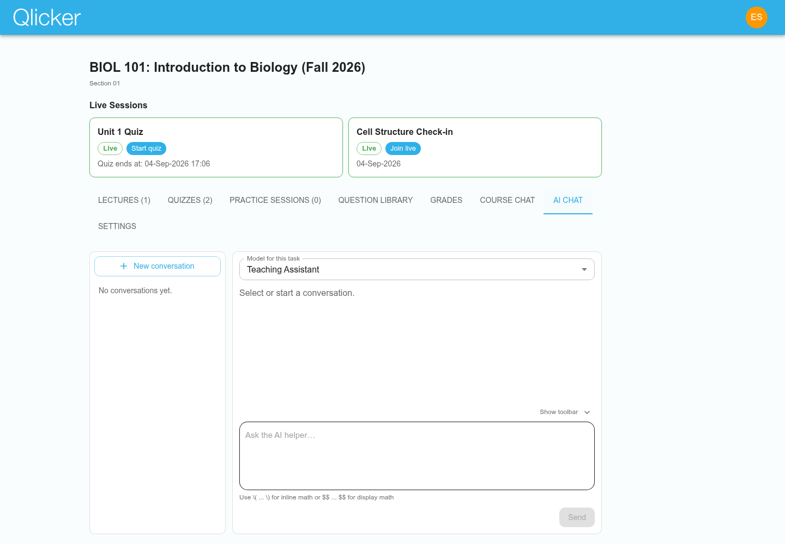

# Student User Manual

Use this manual to join courses, participate in live classes, complete quizzes, review feedback, check grades, use discussion tools, and create your own practice sessions.

If this is your first visit, read [Getting started](getting-started.md) first.

## Contents

1. [Use the student dashboard and enroll](#1-use-the-student-dashboard-and-enroll)
2. [Understand the course page](#2-understand-the-course-page)
3. [Join an interactive live session](#3-join-an-interactive-live-session)
4. [Answer each question type](#4-answer-each-question-type)
5. [Take and submit a quiz](#5-take-and-submit-a-quiz)
6. [Review completed work](#6-review-completed-work)
7. [Read grades and feedback](#7-read-grades-and-feedback)
8. [Create your own practice sessions](#8-create-your-own-practice-sessions)
9. [Use course chat and session chat](#9-use-course-chat-and-session-chat)
10. [Use student AI Chat](#10-use-student-ai-chat)
11. [Use video, notifications, and profile tools](#11-use-video-notifications-and-profile-tools)
12. [Common study scenarios](#12-common-study-scenarios)
13. [Troubleshooting](#13-troubleshooting)

## Quick start for class

1. Sign in a few minutes before class and open the correct course.
2. Select the live activity card when it appears.
3. Enter the current join code if asked, then select **Join Session**.
4. Wait for the instructor to show a question and open responses.
5. Select or enter your answer and submit it.
6. Watch for the confirmation; do not assume an unsent draft was recorded.

## 1. Use the student dashboard and enroll

The dashboard lists your courses and highlights activities that are live now. Use it to return to a course or enter a new enrollment code.

### Enroll in a course

1. Get the current enrollment code from the instructor.
2. Enter it exactly in the enrollment field on your dashboard.
3. Submit the code.
4. Open the new course card and confirm the course name, number, section, and semester.

You normally enroll only once. The course stays on the dashboard until the instructor/admin removes you or the course is no longer available to your account.

### If enrollment fails

- Re-enter the current code; an instructor can regenerate it, making an older code invalid.
- Confirm that you are signed into the intended account.
- Complete email verification if the course requires it.
- Ask the instructor whether the course is active.

Do not post enrollment codes publicly.

## 2. Understand the course page

Open a course to find its activities. The exact tabs depend on course settings and enabled platform features.

| Tab | Use it for |
| --- | --- |
| Lectures | Instructor-paced interactive sessions and their review links |
| Quizzes | Scheduled assessments, practice quizzes, and review links |
| Practice Sessions | Study sets you build for yourself |
| Question Library | Questions your instructor has made available for practice |
| Grades | Your own visible course/session results |
| Course Chat | Course-wide posts and comments when enabled |
| AI Chat | Course-scoped AI assistance when authorized and enabled |
| Video | Course/group Jitsi meeting access when enabled |
| Settings | Student-visible course/account options |

If practice access is disabled, **Practice Sessions** and **Question Library** are hidden. If chat, AI, or video is not configured, those tabs are also absent.

### Session cards

Cards show status and the action currently available: join, start/continue a quiz, review, or no action yet. Quiz cards display the relevant start/end time. A live activity may also appear above the tabs as a quick-access tile.

For courses with many sessions, expand **Search sessions** to search, filter by status, choose rows per page, and navigate pages. The app may load the first group of cards before background loading finishes.

## 3. Join an interactive live session

Interactive sessions follow the instructor's pace.

### Join

1. Open the course and **Lectures** tab.
2. Select the live session card or quick-access tile.
3. If a join period is open, enter the current six-digit code when requested.
4. Select **Join Session**.
5. Wait if the instructor has not made a page visible yet.

The instructor may admit you manually if you arrived while passcode entry was closed. A rotating code can expire, so use the latest code on the classroom display.

### Participate

When the question is visible and responses are open:

1. Read the entire prompt, including images and math.
2. Choose or enter your answer.
3. Select **Submit Response**.
4. Look for the submitted confirmation.
5. If another attempt opens, decide whether to revise before submitting again.

The instructor can independently hide/show the page, open/close responses, show statistics, reveal the solution, and advance. Slides are content pages, not answerable questions.

### Statistics and shared answers

When released, you may see option percentages, a numerical histogram, or a word cloud. For short answers, the shared response list and word cloud have separate visibility controls. Student identities remain hidden from classmates where the UI describes responses as anonymous; instructors can still moderate/authenticate authors.

## 4. Answer each question type

| Type | How to answer |
| --- | --- |
| Multiple Choice | Select the one best option and submit |
| True/False | Select one value and submit |
| Multi-Select | Select every option you believe applies; the scoring method may penalize incorrect selections |
| Numerical | Enter the requested number and units only if the prompt asks for them; grading can use a tolerance |
| Short Answer | Type the requested explanation; rich text, equations, or images may be available |
| Slide | Read it; there is no response to submit |

### Rich text and math

For written responses, use formatting only when it clarifies the answer. Equations may use the math support shown in the editor. Preview carefully: a formatting error can change meaning. If uploads are enabled, attach only relevant images and wait for the image to finish uploading before submitting.

### Attempts

An instructor can allow more than one attempt and weight attempts differently. The current attempt number and open/closed state matter. A response from an earlier attempt does not guarantee that a new attempt was submitted.

## 5. Take and submit a quiz

Quizzes are student-paced within a scheduled window. An instructor may give you an individual extension, so your end time can differ from the main class.

### Before starting

- Check the course/quiz name and the displayed start/end time.
- Confirm whether the time is shown in 12-hour or 24-hour format.
- Use a stable connection and allow enough uninterrupted time.
- Close duplicate Qlicker tabs to avoid confusion about the newest saved answer.

### Complete the quiz

1. Open **Quizzes** and select **Start quiz** or **Continue quiz**.
2. Read the instructions and progress indicator.
3. Answer each question. Your response saves as you navigate.
4. Revisit unanswered items before the deadline.
5. Select **Submit Quiz** and confirm only when finished.

A submitted normal quiz cannot be edited again. If time expires, the server's rules determine whether further saves/submission are accepted; do not rely on leaving the page open past the deadline.

### Practice quiz versus normal quiz

A practice quiz is designed for rehearsal and may support repeated review. A normal quiz is an assessment and normally locks after final submission. Read the card label before starting.

## 6. Review completed work

When an instructor ends an activity and makes it reviewable, its card offers **Review**.

### Review effectively

For each question, compare:

1. the prompt
2. your submitted answer and attempt
3. the correct answer or released solution
4. points earned and possible
5. instructor feedback

Move one question at a time and write down the misconception, not just the correct choice. Then try a related practice question.

Not every detail is always released. The instructor controls reviewability and grade visibility. Live session chat is not shown in the student review page even though instructors can retain/review it for moderation.

## 7. Read grades and feedback

The **Grades** tab shows only your own results and only sessions the instructor has made visible/reviewable under the current rules.

- Objective items may be graded automatically.
- Short answers usually remain incomplete until an instructor assigns points.
- Feedback can appear after the initial result.
- A session can disappear if the instructor turns reviewability off while correcting results.
- Participation and score are different measures; a submitted answer can receive participation credit but zero correctness points.

Open the corresponding review page to understand a grade. If you believe something is wrong, identify the course, session, question number/type, attempt, and what you expected; do not send passwords or access tokens.

See [Grading guide](grading.md) for the shared rules.

## 8. Create your own practice sessions

A practice session is a personal study set you build for a course. You choose the questions and work through them at your own pace. Creating one does not submit an answer to an instructor's quiz or live session.

### Before you start

Open the course and look for **Practice Sessions** and **Question Library**. Both require the instructor to enable practice-question access. If the tabs are missing, ask the instructor; changing browsers will not enable them. The library contains questions available to your account, including your own private questions. It does not expose hidden assessment material.

### Name your study set

1. On the course page, open **Practice Sessions**.
2. Select **New practice session**.
3. Enter a **Practice session name**, such as “Cell biology — revision for Quiz 2”. A name is required.
4. Optionally select **Session tags** from the course's topic list to describe the material you want to study.

### Add questions from the library

1. Select **Add question**, then **Copy from Question Library**.
2. Search or filter the library for the topic or question type you need.
3. Select the questions you want, then choose **Add selected questions to practice session**. The dialog closes and the selected questions appear in the editor.
4. To build a varied set instead, enter a **Random count** and choose **Randomly add … questions from the list**. Filter the list first to keep the random selection on topic.
5. Use **Add question** above, below, or between existing questions to choose where more material is inserted. **Remove** takes a question out of the selected set; it does not delete the original library question.

*Example: select questions about cell biology, check the prompts in the editor, then save the set before starting your revision.*

### Write a question of your own

1. Select **Add question → Create New**.
2. Choose the question type and write the prompt. For an answerable question, fill in the options or expected answer appropriate to that type; include a solution when it will help you study later.
3. Choose topic tags if useful, wait for the editor's save confirmation, and close the question editor. The new question is added to your practice set.
4. Use the pencil/**Edit** control to revise questions you own. Questions are saved separately from the practice session, so cancelling the session editor does not undo question edits already saved.

For example, after reviewing an incorrect numerical answer, create a related question with different numbers and a worked solution. Try solving it on paper before revealing that solution.

### Save, study, and return later

1. Select **Save and start practice**. This saves the name, tags, and selected question list, then opens the practice review page. Selecting questions alone does not save the session.
2. Work through the questions. Attempt each answer yourself before using **Show Solution** when available. This is a self-study review workflow; it is separate from submitting a graded quiz.
3. Return to the course's **Practice Sessions** tab to reopen your saved set. Use its pencil/**Edit** control to rename it or change its questions, then select **Save and start practice** again.
4. To remove a set you no longer need, select its **Delete** control and confirm. Check the session name before confirming.

If saving fails, remain on the editor and read the error message. Check that the name is filled in and that the course still allows practice. If no library questions match, clear filters, create your own question, or ask the instructor what material is available. For exam revision, start with a small topic-focused set, then make a second mixed set using random selection.

## 9. Use course chat and session chat

Course chat and session chat are separate spaces:

| Tool | Use it for |
| --- | --- |
| **Course Chat** | Questions and resources that remain relevant across multiple classes |
| **Session Chat** | Immediate, question-specific discussion during one live activity |

### Course chat

The **Course Chat** tab appears only when your instructor enables it.

To start a discussion:

1. Open **Course Chat**.
2. Select **New post**.
3. Enter a short, specific topic title.
4. Add relevant course-topic tags when available.
5. Write the question or resource and publish it.

Open a topic to read or add comments. Upvote a helpful topic/comment instead of posting a duplicate. Use the tag and sorting controls to find earlier answers before starting a new discussion.

Posts and comments can contain rich text, equations, images, links, and embedded video. You may edit your own active post and delete your own material where the visible controls permit. Older discussions can be archived automatically according to the course retention setting.

Your identity is hidden from other students, but instructors/TAs can identify authors for moderation. Anonymity is not permission to violate course conduct rules.

### Session chat

When enabled, the **Chat** panel appears beside **Question** during a live activity. A badge shows unseen chat activity while you are answering.

- Write a normal post or comment when rich-text chat is enabled.
- Use a quick post to signal confusion about the current or an earlier question.
- Upvote an existing question when it matches yours.
- Return to **Question** to submit the activity response; chat messages never count as answers.

The instructor can disable rich-text discussion while leaving quick posts available, dismiss a resolved post, or turn off chat completely. Session chat does not appear in the student review page afterward, although the teaching team can retain it for review and moderation.

### Chat etiquette and safety

- Keep one idea per topic/post and name the question number when relevant.
- Do not post quiz answers, personal information, or content prohibited by course rules.
- Use an upvote rather than repeating a question.
- Contact the instructor privately for personal grading or accommodation matters.

## 10. Use student AI Chat

The **AI Chat** tab appears only when both the institution and your instructor enable a student-approved model for this course. Its conversations are separate from course chat and from your instructor's AI conversations.

### Start a useful conversation

1. Open **AI Chat** on the course page.
2. Create a new conversation for one study goal.
3. Choose from the models your instructor approved.
4. Ask a specific question and name the session, topic, or feedback you mean.
5. Check the response against course material and continue with focused follow-ups.

The assistant may use course-aware tools to:

- summarize the visible schedule and status of instructor-created sessions
- list ended sessions that your instructor made reviewable
- read the questions, released answers, and solutions from those reviewable sessions
- explain your own released points and instructor feedback

Those permissions are checked on every request. Student AI Chat cannot expose draft sessions, hidden solutions, another student's answers/grade, instructor-only grade tables, or instructor conversations.

Use it for explanations, comparisons, practice strategies, or interpreting feedback. Do not assume it knows an assessment policy that is not visible in Qlicker, and do not use generated work where your course prohibits it.

AI responses can be incomplete or wrong. Generated images, audio, or files can also expire; download an allowed artifact when you need to retain it or ask for a new one later. Never paste passwords, private personal information, or restricted assessment material into AI Chat.

## 11. Use video, notifications, and profile tools

### Video

The **Video** tab appears only for courses configured by the institution. Allow microphone/camera access only when needed. Group video destinations depend on your current group assignment.

### Notifications

The avatar badge signals active system or course notices and new feedback. Open **Notifications** to read/dismiss them. Dismissal affects your account only.

### Profile

From the avatar menu, open **Profile** to change language and allowed account fields. Local name/password editing and reset email can be locked for SSO-managed accounts. Profile image uploads open a crop/rotate editor before saving the avatar.

## 12. Common study scenarios

### Prepare for an upcoming quiz

Review the quiz's start/end time, open past reviewable sessions, note weak topics, build a tagged practice session, and repeat only the questions you could not explain. Do not assume practice questions reveal the exact quiz content.

### Rejoin after losing connection live

Reconnect, return to the course, select the live tile again, and use the current join code if requested. Confirm the current page/attempt before submitting; do not keep clicking submit on a stale page.

### Use feedback after manual grading

Open the notification, go to the session review, read the comment with your response visible, and attempt a similar practice question. If feedback is unclear, ask about the specific reasoning step.

### Ask anonymously during class

Use session chat or a quick clarification post. Other students do not see your identity, while the teaching team does. Upvote an existing question when it matches yours.

### Work with an accommodation

Before the assessment, confirm the extension with the instructor. In Qlicker, open the quiz card and check your displayed availability. Report discrepancies before starting when possible.

## 13. Troubleshooting

### I cannot sign in

Confirm whether your institution requires SSO or local email login. SSO-managed accounts may not support password reset. Check spelling and contact the administrator if the account is disabled or the wrong role appears.

### I cannot join a course

Use the newest code, confirm the course is active, finish required email verification, and make sure you are not using a second account.

### I cannot see a live activity

Reload the course page once, check both the quick-access area and **Lectures/Quizzes**, and confirm the activity name with the instructor. A quiz outside its window may be listed but unavailable.

### I cannot submit a live answer

Responses may be closed, the page may be hidden/a slide, your allowed attempts may be used, or the instructor may have advanced. Read the on-screen status before retrying.

### My quiz answer looks unsaved

Stay on the page briefly and look for the save state. Keep the network connected and do not use multiple tabs. If a save error persists, note the exact time/question and tell the instructor immediately.

### I cannot see review or grades

The activity may not be ended/reviewable, grading may still be underway, or visibility may be temporarily disabled while corrections are made. Ask the instructor when results are expected.

### Practice/library tabs are missing

The instructor has disabled practice-question access for this course. This is a course setting, not a browser problem.

### Live pages stop updating

Confirm the network, reload once, and re-enter the activity. If several classmates see the same problem, give the instructor the session name and approximate time.

## Related guides

- [Getting started](getting-started.md)
- [Professor and TA manual](professor.md)
- [Grading guide](grading.md)
